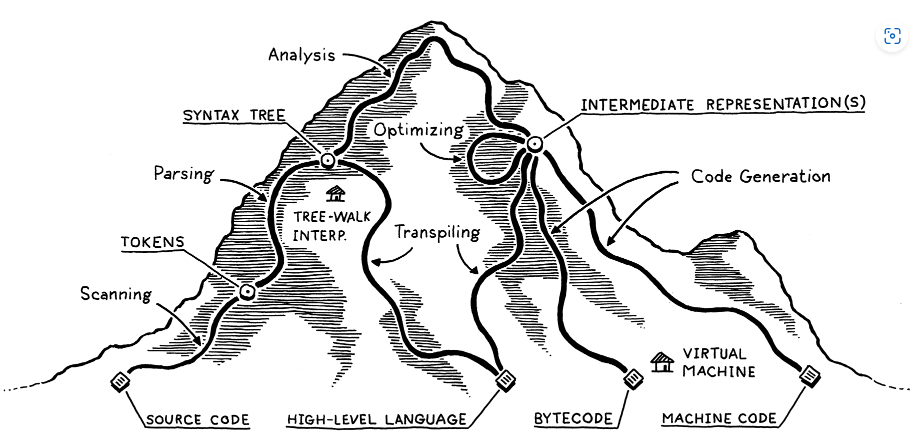

> The highest level representation of code, source code, is transformed to lower and lower-level representations until it reaches the machine code that the computer can execute.

# Frontend
The **front end** of a language implementation is made up of the scanning, parsing, and static analysis stages.
## Scanning
**Scanning**, also known as **lexing**, or **lexical analysis** is the process through which some kind of meaning is derived from a linear stream of characters. Each identified group in the character stream is known as a **token**. A token could be a single character, a string of characters in a literal, identifiers, and more.

## Parsing
**Parsing** is where a syntax gets a grammar, allowing for the composition of larger expressions and statements out of smaller parts.

**Parsers** take the flat sequence of tokens produced by scanning and builds a tree structure mirroring the nested nature of the grammar. There are different names for the trees produced depending on how close they are to the syntactic structure of the language (**parse tree** or **abstract syntax tree**). Language designers often just call them **syntax trees**, **ASTs**, or **trees**.

Parsers are also responsible for telling the user when a **syntax error** occurs, this happens even in the rigid grammars that must be used - human language grammars like English are too complex and messy to be used in a programming language.

## Static analysis
Once the syntactic structure of the language is known, from parsing, further meaning has to be discovered such as what specific variable identifiers refer to.

Commonly, most languages perform **binding** or **resolution** first, where each use of an **identifier** has the location of where its name is defined wired together with its usage. **Scope** comes into this to decide where a certain name can be used to refer to a certain declaration.

> In statically typed languages, **type checking** would also occur here after *resolving* the variables and **type errors** would be thrown if they are used in the wrong way.

The information gleaned from static analysis is then stored somewhere:

- **Attributes** on the syntax tree itself are commonly used, extra fields in nodes can be used for this.
- Sometimes, a **lookup table** is used. Usually, the keys to this table are identifiers (variable names and declarations) and the values associated with each key indicate what the identifier refers to; this is a **symbol table** in this case.
- Other times, the tree is transformed into an entirely new data structure which more directly expresses the codes semantics.

# Middle-end
The middle-end of compilation covers tasks applied upon code where its meaning has been understood, but is not yet to be interpreted or compiled. Transforming the parse trees into an intermediate representation and optimisation are parts of this.

## Intermediate representations
After the front-end has done its job of dissecting the source code and gleaming meaning, the code may be stored in some **intermediate representation** (**IR**) before being passed to the backend. IR acts as an interface between two languages, like the source code and the machine code executed.

## Optimisation
Optimisation is an important part of language design, it allows for inefficient user code to be swapped with more efficient, but equivalent, code during the compilation process of interpretation and compilation.

**Constant folding** is a simple example where if some expression always evaluates to the same value, the evaluation can be done at compile time and the code for the expression replaced with its result:

```cpp
x = 4 + 4
// is replaced with
x = 8
```

# Backend

## Code generation
This is where **code gen** occurs, *code* referring to some kind of primitive assembly-like instructions that a CPU runs. These instructions could be for a real CPU or a virtual one, code generated for a virtual CPU is typically called **bytecode** because each instruction is often one-byte long.

## Virtual machine
For compilers that produce bytecode, a **virtual machine** (VM) is needed to translate the bytecode into something that the actual CPU of the machine it is on can run.

## Runtime
Once the code has been transformed into machine code or bytecode, it has to be executed. Bytecode will be executed by a specially designed VM, machine code will be executed by telling the operating system to load and execute it.

Usually, runtimes provide additional services while the program is running such as automatic memory management (garbage collection), runtime type checking (`instanceof` style tests), etc...

# Shortcuts

## Single-pass compilers
Some simpler compilers will combine parsing, analysis, and code generation so that code is output directly from the parser, without ever creating any syntax trees or other IRs. Such **single-pass compilers** restrict a languages design.

C is an example of a language designed in this vein, this is why forward declarations are needed to tell the compiler what it needs to know to generate code for a call to a function defined after its usage.

## Tree-walk interpreters
Some languages execute code directly after parsing to an AST, the interpreter traverses the tree structure and evaluates each node as it goes.

## Transpilers
**Transpilers** can be useful in language design, they are used for converting your source language to some existing generic IR or other language allowing you to make use of that languages tools to have it interpreted or compiled down to machine code.

> Also known as **source-to-source compilers** or **transcompiler**.

## Just-in-time compilation
This is a process that requires expert knowledge. In JIT compilation, code is directly compiled to the machine code of the machine it is running on.