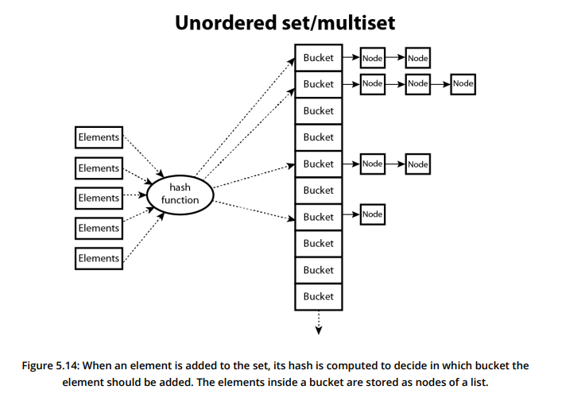
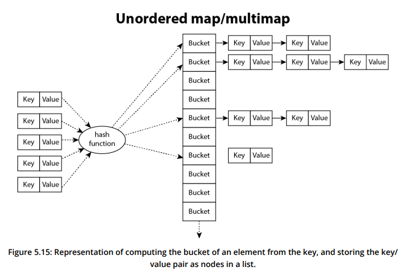

**Unordered associative containers** differ from associative containers in that their elements have no defined order. Visually, they are often imagined as bags of elements. While they do not accept comparator objects, all unordered containers depend on a hash function where a calculated hash represents each elements position.

The user can provide a **Functor** as a parameter to specify how the keys should be hashed.

- **Unordered set**: Container of unsorted elements, all are distinct.
- **Unordered multiset**: Same as unordered set, duplicates allowed though.
- **Unordered map**: Elements are unsorted key-value pairs, each key is distinct.
- **Unordered multimap**: Same as unordered map, duplicate keys allowed though.

Typically, unordered containers are implemented as **hash tables**. The position in the array is determined using the hash function, given a value this function returns the position at which it should be stored.

- A *collision* is when the hash function returns the same value for multiple elements. This is solved by using linked lists to chain elements that map into the same position, allowing multiple elements to be stored in the same position. This position is often called a **bucket** as it could refer to multiple elements.

Using hashes allows for elements to be found with a specific value in constant time complexity, which is even faster for lookup then standard associative containers.

When dealing with maps, the hash of the key is used to decide which bucket the key/value pair resides in:

