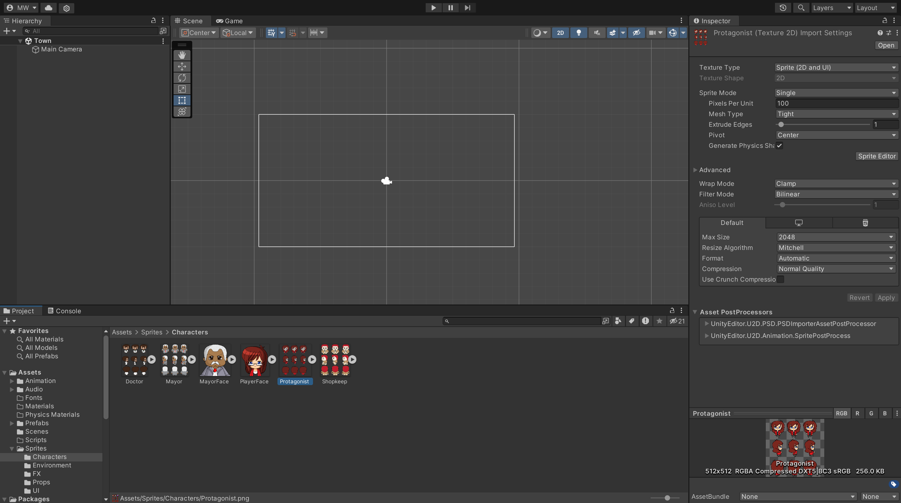
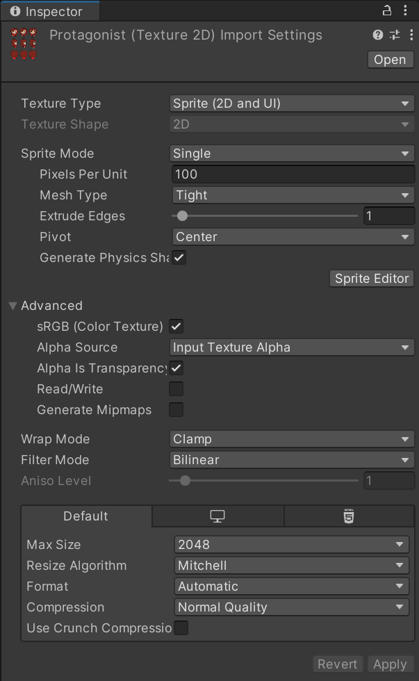
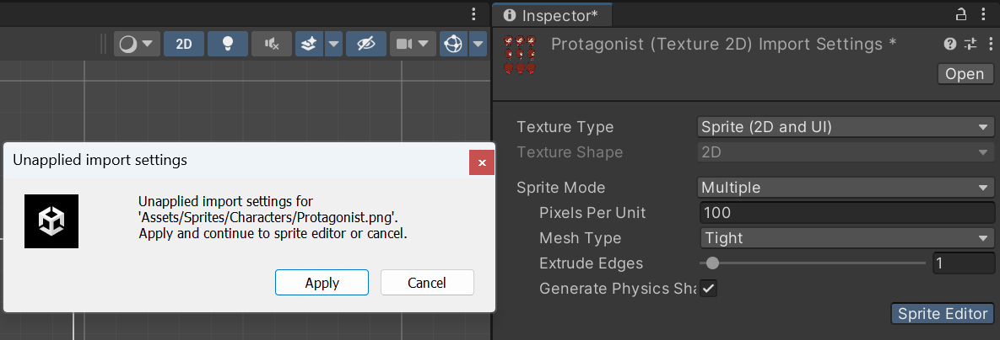
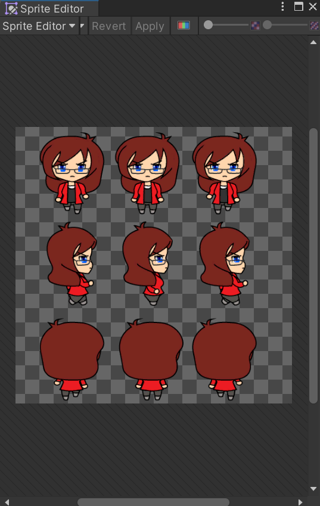
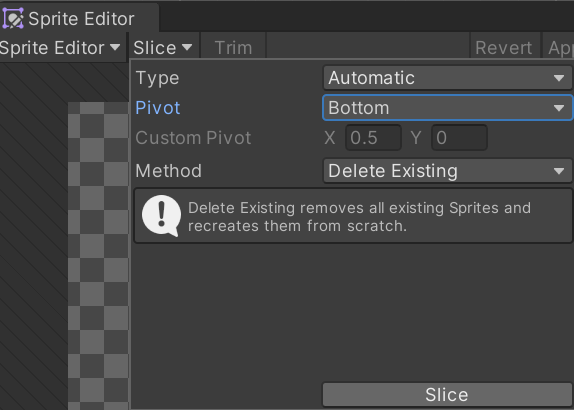
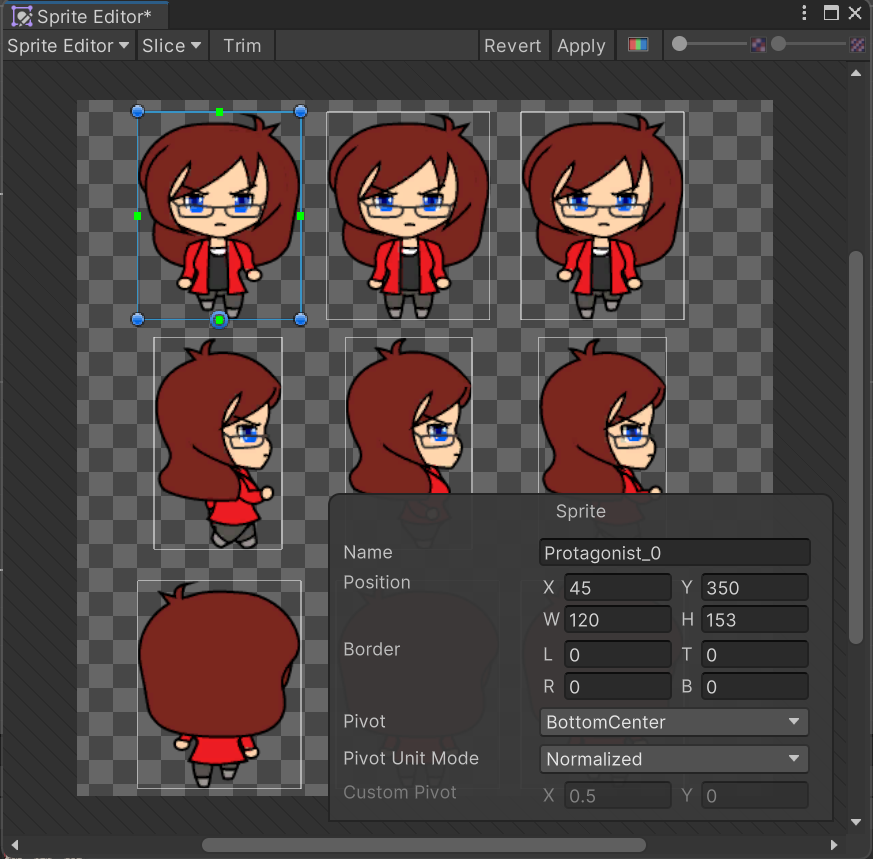
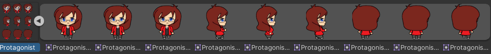

The sprite system in Unity is used for importing and managing your sprites, the sprites add the visual elements to a scene.

## Importing Sprites
The simplest way of including sprites is to drag and drop them from the system file explorer into the **Project** window in Unity. Once an image file is brought in, clicking on the image will show its import settings in the image's inspector:

The sprites import settings are visible in the **Inspector** window, any changes can only be saved by hitting the **Apply** button:

### Texture Type
All new images in Unity have their `Texture Type` set to `Sprite (2D and UI)` in a 2D project instead of `Texture` like in a 3D project.

### Sprite Mode
The **Sprite Mode** is used to indicate what the image represents, like a single or multiple sprite image.

- The **Single** value is used when the image contains only one sprite and it is desired that it remains on a rectangular plain.
- The **Multiple** value is used when importing a sprite sheet or texture atlas, as it contains multiple images.
- The **Polygon** value is used when it is desired that a single sprite is bound by a polygon.

### Packing tag (deprecated)
This is an old option, not present by default, that allows groups to be created which pack sprites into texture atlases. Unity groups all objects with the same tag under a separate texture atlas/sheet together. By default, all assets are grouped onto the default atlas.

> Replacement: [Sprite Atlas Workflow]([Unity - Manual: Sprite Atlas workflow (unity3d.com)](https://docs.unity3d.com/Manual/SpriteAtlasWorkflow.html))

### Pixels Per Unit
Unity uses a measurement system based on *units*, 1 unit is equal to 1 metre by default. This setting allows for scaling image assets at import time, the default being 100 pixels per unit (scaled up to 100%).

This is an important setting as it sets the relative scale of assets to the defined game units, this helps guide you on how different objects scale to each other.

### Pivot
The `Pivot` option allows for setting the pivot point of a sprite, this determines where a sprites position is registered and the point which the sprite rotates around. By default, it is set to `Center`; this positions the centre of a sprite on the coordinates it is positioned at in a scene.

### Generate Mip Maps
A **Mip Map** is a smaller version of a texture, it is used when objects further away from the camera will look smaller and thus require less detail. It is a performance optimisation essentially. In a 2D game with an orthographic view (objects far away appear the same size as those close to you), it is usually best to leave this setting off.

### Filter mode
The **Filter Mode** is used when working with a *perspective camera* and planning on manipulating objects in a 3D space. The **Billinear** and **Trilinear** values blur textures as they get closer to the camera while **Point (no filter)** makes it blocky.

### Default settings and per-platform overrides
The `Max Size` of a texture is set under the default settings, imported images are usually set to `2048x2048` pixels by default. When developing for different platforms, it is important to consider whether the resolution size of the textures needs to be changed due to any limitations.

## The Sprite Editor
The main usage of the **Sprite Editor** is for identifying regions of sprite sheets and texture atlases that represent single sprites, it can also be used for specifying custom pivot points for sprites using the **Pivot Point** drop-down menu.

Two sets of functionality are offered, the **sprite splitter** and the **view controls**. Which options are available vary depending on the **Sprite Mode**.

### The Sprite Slicer
If a sprite has its **Sprite Mode** set to **Multiple**, the **Slice** drop-down menu will be enabled in the editor. The slicer has three modes:

- **Automatic**: This automatically slices the sprite sheet based on the alpha regions within the texture. A **Pivot** option is provided to set the default pivot position for imported sprites, a **Method** is also available to guide the selection logic used to identify sprites (the **Delete Existing** value clears any existing sprite ranges from a sheet, **Smart** will attempt to identify common patterns, **Safe** focuses on tighter regions around each element identified on the sprite sheet).
- **Grid By Cell Size**: Allows for defining a grid over a sprite sheet with defined cell sizes set by the heigh and width options. The **Offset** option is used to tell the Unity Sprite Editor where the grids should start relative to the top-left corner, the **Padding** tells the sprite editor how much space is between the various grids.
- **Grid By Cell Count**: Works similar to **Grid By Cell Size**, except it allows the number of rows and columns to be specified rather than the size of the sprites.

These modes modify how the sprite sheet is split for creating individual images used in a game.

### View controls
The view controls are used to change or affect what is being viewed in the sprite editor. View controls include:

- **Revert**: Resets the texture back to the original settings the editor had when it was opened, or the settings when the apply option was last used.
- **Apply**: Applies any changes made in the editor, these changes cannot be undone.
- **Alpha/Color**: Changes the view between fully textured sprites and alpha regions.
- **Zoom Slider**: Used for zooming in an out.
- **Pixelation Slider**: Changes the resolution of the sprite texture, full resolution is when the slider is all the way to the right.

### Sprite Region Manipulation
When working with a single sprite or individual regions from a sprite sheet, the import settings for each region can be changed individually in the sprite editor. Settings that can be changed include:

- Sprite name.
- Region of the sprites bounding box by changing the **Position**, **Border**, physically adjusting with the mouse using hook points, and using the **Trim** button to snap the bounding box close to the sprites edges.
- The pivot point via the **Pivot** drop-down or physically moving it via the pivot circle.

## Importing a sprite sheet example
Select an asset from the `Assets` folder that represents a sprite sheet. In the **Inspector**, change the **Sprite Mode** to **Multiple** and then select the **Sprite Editor** button. 

Select **Apply** when prompted to bring up the Sprite Editor:

Expand the Sprite Editor if necessary to see the **Slice** drop-down. Set the `Type` to `Automatic` and the `Pivot` to `Bottom`:

Select the `Slice` button to see the sprites now surrounded by bounding boxes, clicking any one of them will also bring up the individual sprites options:

> When working with sprite sheets that have a walking animation, `Bottom` is generally the best pivot point.

Select the `Apply` button and close the editor. In the assets window, the imported image asset will now have an arrow that can be clicked to show the individual sprites sliced from the sprite sheet:

The individual sprites can then be dragged as needed onto a sprite object to be its texture.