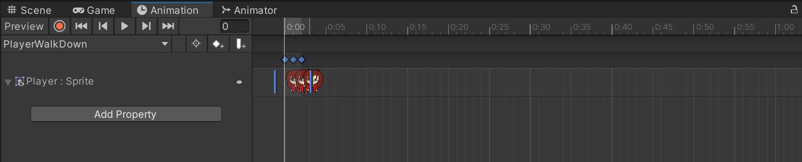
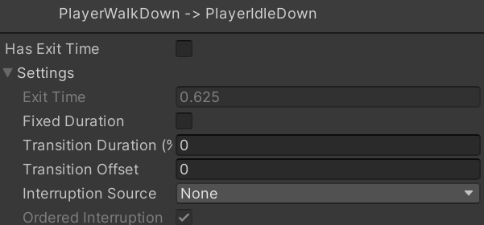

The player character currently isn't animated, this means only a single image is shown when moving about. The sprite sheet for the player has three angles which can be used to animate walking though.

Three things are needed:

- An **Animator Component** on the GameObject
- An **Animator Controller** to manage the animation bound to the animator
- At least one **Animation clip** to play in the controller

When a new animation clip is created for a game object, the other items will be automatically created.

The **Animation** and **Animator** windows can be opened using the `Window > Animation > Animation` and `Window > Animation > Animator` options from the menu bar.

## Adding the animation clip
To create an animation clip, select the game object from the **Hierarchy** (or from the **Scene** view) and open the **Animation** tab. A prompt to create an animator and clip should appear:


Select `Create` and then save the animation with an appropriate name within the `Assets/Animation/Clips` folder (the file type needs to be `.anim`). Unity will automatically create an Animator for the selected game object, automatically assigning the game object with an Animator component.. The Animator (controller) will have been automatically created in the clips folder, so it should be moved to the `Assets/Animation/Controllers` folder to maintain file structure integrity:


The Animator controller will be given the same name as the game object it is attached to by Unity, the animation will have the name set when you created the clip.

In the **Animation** window, the name of the new animation clip should be visible in the drop-down menu:


In the **Project** view, navigate to the `Assets/Sprites/Characters` folder to find the desired sprite sheet and associated sliced sprites which will represent the animation:


Select the three images, then drag and drop them into the **Animation** window's **Dope Sheet**:



> If the sprites won't allow you to drag and drop them, make sure to select the game object in the **Hierarchy** before trying it.

This animation is quite fast though, adjust the **Samples** from the default 60 to 6 to reduce the frame rate. Alternatively, the images on can be dragged further apart on the timeline. (Keep in mind that 1:00 represents 1 second, not 1 minute). You may need to select the three dots at the top right of the Animation window and select **Show Sample Rate** for it to be visible:


In some cases, like this walking animation, the core three sprites (three frames) are not enough for a fluid walk animation. To correct the loop, a fourth frame needs to be added where the feet are brought back to centre. Add this frame to the animation using the same process as before, except only dragging one.

After adding at least one animation to a game object, a `Create` button won't appear in the centre of the Animation window. Instead, open the animation selection drop-down menu and select `Create New Clip`:


## Setting up the Animator and default state
The animator controller is automatically created by Unity when the animation is created using the above process, it was also automatically assigned to the corresponding game object as a component which can be viewed in the **Inspector**:


The animator should be renamed to be more appropriate, in this case `PlayerWalking` for the walking animation would be appropriate. Update the animations name in the **Project** window, the change will be automatically reflected in the component in the **Inspector**.

After doing this, open the **Animator** window:


The `PlayerWalkDown.anim` animation has already been added to the Animator, it has also been designated as the default state due to being the first animation created. This causes the animation to play as soon as the game starts, even though the player isn't moving. This is not the desired behaviour but is easily resolved.

First, create an empty default state by right-clicking anywhere in the Animator Window and selecting `Create State > Empty`. After doing this, rename it to `PlayerStandDown` in the **Inspector** (the state node needs to be selected) and then right-click it and select `Set as Layer Default State` to make this the new default state:


The player will no longer animate on game start. To get the animation playing, the controller has to be told how and when to run the animation.

### Planning animation transitions
When multiple animations exists, such as ones for walking up, down, and horizontally. It is important appropriately plan which animations will play in which direction. The main ones to consider are which animations to play when walking diagonally, should it be side view or the upwards and downwards facing animations...

In the case of a single animation for walking up, walking down, and one for walking horizontally, it might be:

- Only play the Horizontal movement animation when vertical movement is 0.
	- If the horizontal movement is less than 0, the horizontal movement animation should be flipped along the x-axis.
- If the players vertical movement is greater than 0, the walking up animation will play.
- If the players vertical movement is less than 0, the walking down animation will play.
- When the character is not moving, the player needs to be stood still with legs together facing the same direction as was prior moving in.

### Connecting animation states
Currently, no animation states have been connected. To change that and tell the controller to move between different states, the following pre-requisites are required:

- A **transition link** between the two states
- A **parameter** or **event** to activate the transition
- Something to change the value of the parameter or trigger the event, usually from a script

It is a good idea at this stage to open the Animator and organise any animation nodes to make them easier to work with:


As the player, in this example, will be able to move between any of the animations regardless of the last one to play, **Transitions** need to be set up from the **Any State** node. To create these transitions, right-click the **Any State** node and select **Make Transition**. The mouse cursor will change to an arrow, select the state to transition to and repeat for any necessary animation states:


Setting up the transitions like this informs the Animator that the game object can be standing in the default state, and go to any of the other animations and transition from those to another animation.

To tell the Animator controller when the transitions should occur, some **Parameters** and **Transition Conditions** need to be added. Selecting a transition between **Any State** and one of the animation needs will show its properties in the **Inspector**:


Clicking on the arrow next to **Settings** will reveal more properties:


If the **Exit Time** parameter is selected, a transition to a second animation would occur when the first finishes. In the case of walking, that isn't desired here. Instead, a specific event to control when the animation is activated is desired. Change the settings to be as follows:


Do the same for any other walking transitions from **Any State**.

After changing the settings, a condition can be added by creating a **transition parameter**. To add a new parameter, select the **Parameters** tab in the Animator. Then click on the `+` symbol in the parameter section, and select an appropriate type (**Int** in this case):


The `yMove` parameter will be used to tell the animator when it should transition between the walking down and walking up states. A transition condition then needs to be created which is used to trigger the animation. Select the transition between **Any State** and **PlayerWalkDown**, then select the `+` symbol in the **Conditions** section of the **Inspector**. As `yMove` is the only parameter, it will be automatically added. Select **Less** from the drop-down menu:


This condition states that when the `yMove` parameter is less than 0, the **PlayerWalkDown** animation will be triggered on the attached game object.

- The same is then done for the **Any State** and **PlayerWalkUp** transition, but **Greater** is selected as the condition.

For horizontal movement, an `xMove` parameter of type Bool is needed. This is used to tell the animator when to transition to the **PlayerWalkHorizontal** animation. The matching condition for the transition between **Any State** and **PlayerWalkHorizontal** should be `xMove` with a value of `true`:


At this point, animations still don't trigger when the character is moved. The Animator has been told when the animations need to occur, but nothing has been done to change the parameter values from a script. The `CharacterMovement` script needs to be updated for this.

## Accessing controllers from a script
Once an animator component has been attached to a game object, it can be accessed and have its parameters adjusted from a script. Two main things to do are required:

1. Create a variable for the Animator so it can be referenced in the script
2. Use `GetComponent` to find the Animator component attached to the game object

To do this, add a field for an `Animator` object:

```c#
public class CharacterMovement : MonoBehaviour
{
    private Animator animator;
}
```

In the `Awake()` method, the animator can then be assigned:

```c#
public class CharacterMovement : MonoBehaviour
{
	private void Awake()
	{
	    animator = GetComponent<Animator>();
	}
}
```

This allows for the animator to be referenced in the script. The player's sprite renderer also needs to be accessed from within the script, this is to allow flipping the sprite when walking left instead of right as the sprite sheet used only has animation frames for walking right. The sprite renderer component is accessed in the same way as other components:

```c#
public class CharacterMovement : MonoBehaviour
{
	private SpriteRenderer spriteRenderer;
	
	private void Awake()
	{
	    spriteRenderer = GetComponent<SpriteRenderer>();
	}
}
```

Next, add a method for updating the animation state and then invoke it from the `Update()` method after the input values have been retrieved:

```cpp
public class CharacterMovement : MonoBehaviour
{
	void Update()
	{
	    movePlayerHorizontal = Input.GetAxis("Horizontal");
	    movePlayerVertical = Input.GetAxis("Vertical");
	    movement = new Vector2(movePlayerHorizontal, movePlayerVertical);

		UpdateAnimationState();
	}

	private void UpdateAnimationState()
	{
	    if (movePlayerVertical != 0)
	    {
	        animator.SetBool("xMove", false);
	        spriteRenderer.flipX = false;
	
	        if (movePlayerVertical < 0) animator.SetInteger("yMove", -1);
	        else if (movePlayerVertical > 0) animator.SetInteger("yMove", 1);
	    } else
	    {
	        animator.SetInteger("yMove", 0);
	
	        if (movePlayerHorizontal > 0)
	        {
	            animator.SetBool("xMove", true);
	            spriteRenderer.flipX = false; // moving right
	        } else if (movePlayerHorizontal < 0)
	        {
	            animator.SetBool("xMove", true);
	            spriteRenderer.flipX = true; // moving left
	        } else
	        {
	            animator.SetBool("xMove", false);
	        }
	    }
	}
}
```

At this point, the character should now change animation depending on which way it is facing. Although, the player animations won't stop when the player isn't moving. That will require more animations and another transition parameter.

### Making the animation stop and face the correct direction
To stop the walking animations, three idle animations will be required (one for each direction). The easiest way to do this is to duplicate the walking animations and editing them appropriately. This can be done by right-clicking them in the **Project** window.

First, do this by selecting the `PlayerWalkDown.anim` file and duplicating it with `CTRL+C` and then `CTRL+V`. Rename the new animation to `PlayerIdleDown.anim`. Then drag and drop this new animation into the Player's Animator:


Open the Animation window and select the **PlayerIdleDown** animation from the drop-down menu, then delete all of the images except the one where the player is standing still and facing downwards, leaving a single image.

Repeat this process to create the `PlayerIdleUp` and `PlayerIdleHorizontal` animations.

Once this has been completed, set up transitions in the **Animator** from the walking animations to the idle animations:


Once this has been done, change the new transitions to have the following settings:



Now, create a **Bool** parameter called `moving`. Set the conditions of the new idle transitions so that they activate when `moving` is `false`. Once done, it then just requires that the animation code is slightly modified to modify the `moving` parameter when it is and is not moving:

```c#
private void UpdateAnimationState()
{
	// new condition for idle animation
    if (movePlayerVertical == 0 && movePlayerVertical == 0) animator.SetBool("moving", false);
    else animator.SetBool("moving", true);
	//

    if (movePlayerVertical != 0)
    {
        animator.SetBool("xMove", false);
        spriteRenderer.flipX = false;

        if (movePlayerVertical < 0) animator.SetInteger("yMove", -1);
        else if (movePlayerVertical > 0) animator.SetInteger("yMove", 1);
    } else
    {
        animator.SetInteger("yMove", 0);

        if (movePlayerHorizontal > 0)
        {
            animator.SetBool("xMove", true);
            spriteRenderer.flipX = false; // moving right
        } else if (movePlayerHorizontal < 0)
        {
            animator.SetBool("xMove", true);
            spriteRenderer.flipX = true; // moving left
        } else
        {
            animator.SetBool("xMove", false);
        }
    }
}
```

The character should now be able to walk around and stand facing the correct direction when it stops.