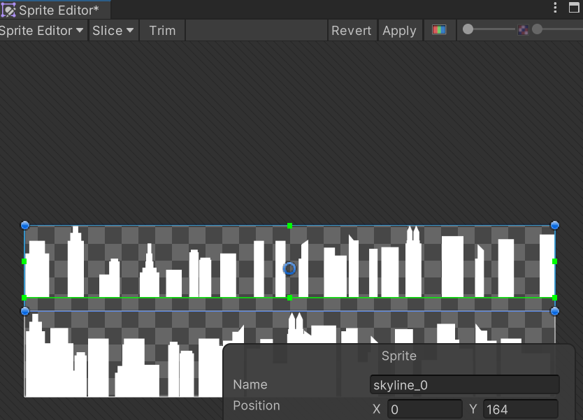

Environments are an important part of any game, they are used to add the background and foreground details to a game for immersion.

In 2D games, these environments are created using sprites and spritesheets just like the character and animations.

## Whether to slice or not
Some assets may be represented as a single sprite texture, others may be sheets containing multiple sprite textures. When creating assets, whether to create them as singular sprites or sprite sheets depends on the circumstances.

Generally, it is more appropriate to pack multiple images of the same type on to a single asset/atlas. The Sprite Editor can then be used to define the regions on the sprite texture for each sprite. This is because when Unity renders a sprite on the screen, it has to be sent to the graphics card for processing. If there are lots of single images, this can take a lot of time. By packing multiple images/sprites into one sprite sheet, the required images for a scene can all be sent at once and reduce the load; this improves the performance.

> A caveat is that too large a sprite sheet can also be detrimental, just like too many small single sprites being sent. A balance needs to be found.

Some rules of thumb include:

- Backgrounds made up of large images or that are full-screen, keep it as a separate sprite texture.
- If there are many images all for the same scene, combine them into a single sprite sheet/atlas.
- If there are many images for different scenes, group them as is most appropriate into separate sprite sheets according to their general type.

## Adding a background
A background could be a simple single large texture or the combination of multiple textures, storing them in the `Assets/Sprites/Environment` folder is appropriate. Once placed in the assets folder and is visible in the **Project** window, nothing needs to be done aside from ensuring it has been imported as a **Sprite (2D and UI)**:

There may be other sprites that are laid on top of a background, these may or may not have transparencies. In the case of some sprite sheets, they might represent skylines which are made up of rows. This would require slicing by **Grid By Cell Count** and adjusting the bounding boxes as necessary to remove any empty space around the sprites:

### Preparing additional background details
Alongside the background and any other background related details like skylines, there will be other details like buildings and roads that are to be added. Preparing the sprites for these is much the same, automatic slicing will be appropriate if the sheets represent multiple single sprites rather than a group.

## Building the scene
Once the assets for the background are prepared, the scene can be built from the prepared sprite textures.

### Adding the main background
For this, the **Scene** view should be opened. The background image can then be dragged on to the scene, but this will result in the player seemingly having vanished:

This happens because Unity's sprite system has an ordering system, layers are used to decide which sprites are laid on top of others.

### Sprite Sorting Layers
A **sorting layer** is a collection of sprites, these sprites are bulked together to form a single group. The settings for which are under `Edit > Project Settings > Tags and Layers`. The layers can be configured to draw sprites in a specific order on the screen.

### Sprite Sorting Order
Alongside the layers that a group of sprites can reside in, they can also have an order in an individual layer. To control the order of sprites within a layer, the **Order in Layer** property of the **Sprite Renderer** component for each sprite in the **Inspector** can be adjusted. Higher numbers place sprites above others in the same layer.

### Updating the scene sorting layers
It is useful to add different scene sorting layers to organise how the sprites are rendered, these layers can be added via the `Edit > Project Settings > Tags and Layers` window under the `Sorting Layers` dropdown. Some simple layers that could be added include:

- Background
- Middleground
- Foreground

It is important to order the layers correctly, so the **Background** layer should be above the **Middleground** layer in the list. This is because sprites in layers towards the top of the sorting layers will be the furthest back, layers towards the bottom will appear in front:

Once the layers are set up, selecting a game object will allow its sorting layer to be chosen in the **Inspector**:

Settings the players sorting layer to **Middleground** will then result in the player appearing in front of the background image as desired:

### Building out the scene
Before adding more objects to the scene which provide details, like buildings, bins, trees, etc... The background should be built out to properly cover the size of the scene. This can be quickly done by duplicating the existing background image and placing them side by side:

Having multiple game objects can result in a lot of clutter in the **Hierarchy** window, it is good practice to group related objects together. To do this, right-click in the **Hierarchy** and select `Create Empty` to create a new game object that will act as a container. The background images can then be dragged in to this object, set the **Transform** components position to `(0,0,0)` will also help ensure it is centred appropriately:

Other background details like sidewalks and roads can also then be added to the `Background` sorting layer, they should be given an `Order in Layer` of `1` to make sure they appear in front of the background images though:

The new sprites should also be grouped appropriately to make them easier to manage, they can then be dragged into position as needed.

