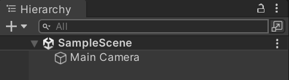

A **scene** is a representation in Unity for every distinct area or level of a game, a scene exists for each one. Examples could be a scene for each of: start screen, a town, a village, a shop, etc...

When a new project is created, a default blank scene called the `SampleScene` is provided that only contains a camera:

Scenes can be created from this by going to `File > Save Scene as...`, alternatively the `File > New Scene` option can be selected instead. The new scenes will show up in the `Assets` folder and in the hierarchy. 

