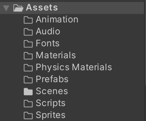

When starting a new project, Unity creates an **Assets** folder. It is good practice to give this folder a structure in which to place your assets. The best practice is to group objects by their type in the folder:

These top-level organisational folders can then be further subdivided.

- In the `Animation` folder, create a `Clips` and `Controllers` folder to separate animation clips from the controllers that act on them or the models.
- In the `Audio` folder, group audio by its intended use. A good structure would be `Enemy`, `FX`, `Music`, `Player`.
- Group prefabs in the `Prefabs` folder by layer or intended use, with folders like `Characters`, `Environment`, `FX`, `Props`, `UI`.
- Sprites can be grouped like prefabs are inside the `Sprites` folder, so subfolders like `Characters`, `Environment`, `FX`, `Props`, `UI`.

## Naming assets
Typically, there is no specific pattern used in all projects but some common ones are:

- Prefixing the name with a three letter acronym for its type like `scn` for a scene, `efx` for an effect, etc...
- Suffixing an underscore plus the three letter acronym for its type to the end of the assets name.
- Using a path-like name.