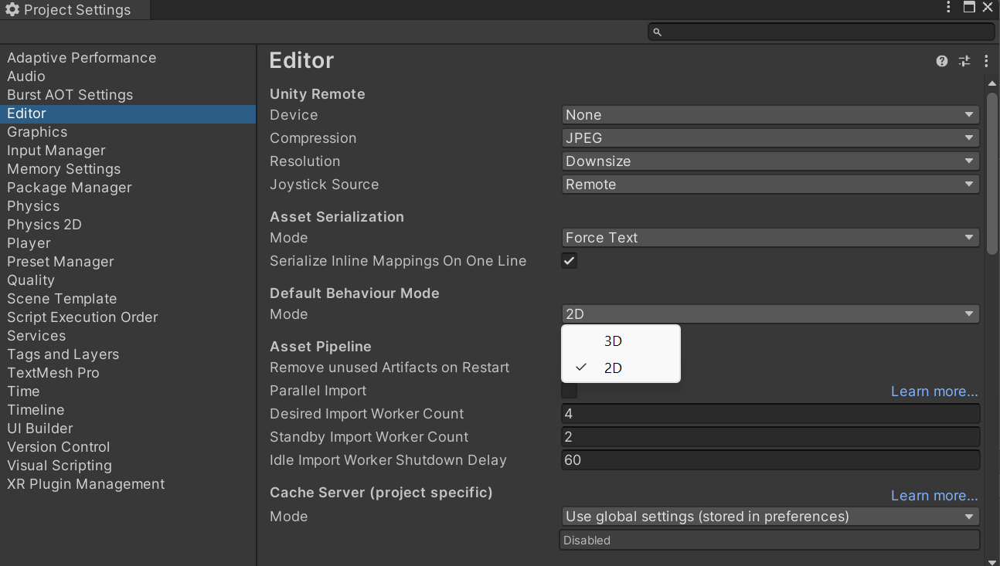

As of Unity 4.3, Unity has built-in support for 2D game development which simplifies the process of creating a 2D game.

When creating a new project, 2D and 3D modes can be selected. The two main differences are in the way assets are imported and the default cameras position and view. 

A 2D project provides a default camera in an **Orthographic** projection, the camera's position is set to `(0, 0, -10)`. Scenes will be in a 2D view, and images are imported as sprites instead of textures.

Swap between the two modes (2D and 3D) by accessing the **Project Settings** via **Edit > Project Settings | Editor**, then changing the **Default Behaviour Mode**:

