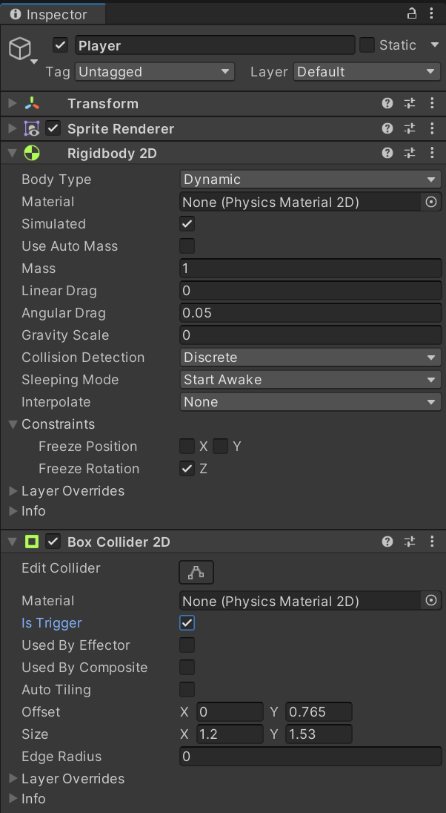

A player sprite that cannot be controlled is useless, adding a script that allows moving the player is relatively simple.

First, a `RigidBody2D` component and `BoxCollider2D` component should be added to the `Player` game object.

- Set the **Gravity Scale** to 0 as gravity is not being used and check the **Freeze Rotation Z** checkbox.
- Select **Is Trigger** on the collider to let Unity know to check if the character is touching an object and to prevent it from passing through if so.



> In a game that uses gravity, two box collider components would be needed. One to check if the character touched other objects (**Is Trigger** selected) and another to prevent the character from passing through other objects (**Is Trigger** not selected).

Create a new script called `CharacterMovement` and place the following code inside:

```c#
public class CharacterMovement : MonoBehaviour
{
    // instance for the player
    private Rigidbody2D rigidbody;

    // tracking how much movement needed from input
    private float movePlayerHorizontal;
    private float movePlayerVertical;
    private Vector2 movement;

    // speed modifier
    private float speed = 4.0f;

    private void Awake()
    {
        rigidbody = GetComponent<Rigidbody2D>();
    }

    // Update is called once per frame
    void Update()
    {
        movePlayerHorizontal = Input.GetAxis("Horizontal");
        movePlayerVertical = Input.GetAxis("Vertical");
        movement = new Vector2(movePlayerHorizontal, movePlayerVertical);

        rigidbody.velocity = speed * movement;
    }
}
```

- The `Awake()` method is utilised to retrieve the `RigidBody2D` component of the game object.
- The `Update()` method is updated per frame:
	- `Input.GetAxis()` utilises the old input system to get the keyboard input.
	- The `rigidbody.velocity` property is utilised to assign the `Vector2` representing the players movement, the `speed` is multiplied by the `movement` vector to represent how far to move each frame. Multiplying this by `Time.deltaTime` should be done, but requires large speed values and causes a weird occasional stutter issue when moving. This is because setting the `velocity` of the `RigidBody2D` directly represents the velocity of the rigid body in units per second.

This code isn't framerate independent, bear in mind.

Once the script is created, it can be attached to the `Player` game object. This can be done by dragging it onto the object or selecting `Add Component` and typing in the name of the script and then selecting it.

Running the project after this will allow moving the player sprite with the keyboard.

## An Alternative way of moving the player
The previous example modifies the velocity of the games rigid body directly, this is useful for physics-based movement where more realistic and dynamic interactions are desired.

Alternatively, modifying the `Transform` object can be preferable for simple 2D games:

```c#
public class CharacterMovement : MonoBehaviour
{
	[SerializeField]
	private float moveSpeed = 4f;

	void Update()
	{
		float moveHorizontal = Input.GetAxis("Horizontal");
		float moveVertical = Input.GetAxis("Vertical");

		Vector3 movement = new Vector3(moveHorizontal, moveVertical, 0f) * moveSpeed * Time.deltaTime;
		transform.Translate(movement);
	}
}
```

Each object has an accessible `Transform` object in the property `transform`, calling the `Translate` method allows for a `Vector3` instance to be passed as input for moving the player. Multiplying this by `Time.deltaTime` makes the movement frame rate independent.