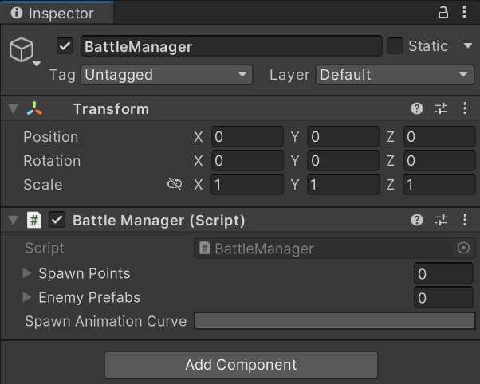
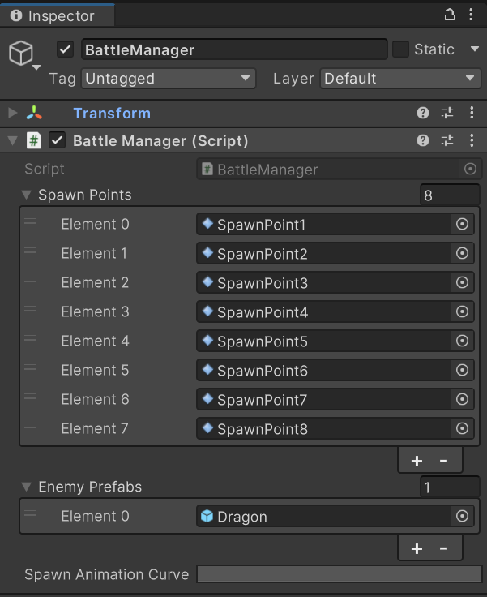
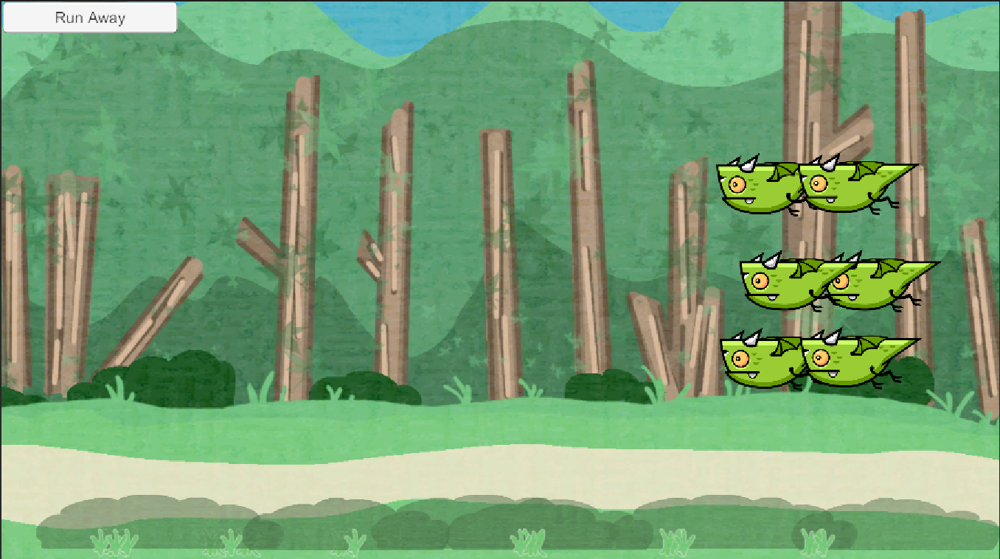
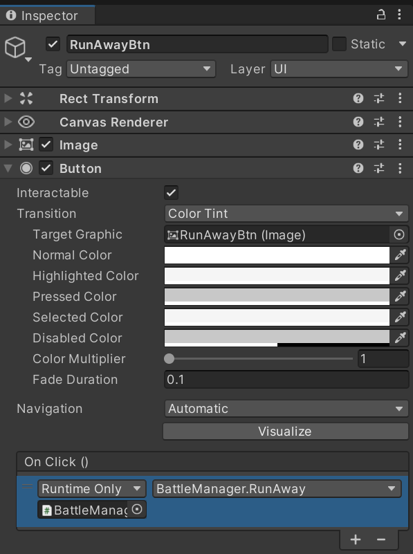
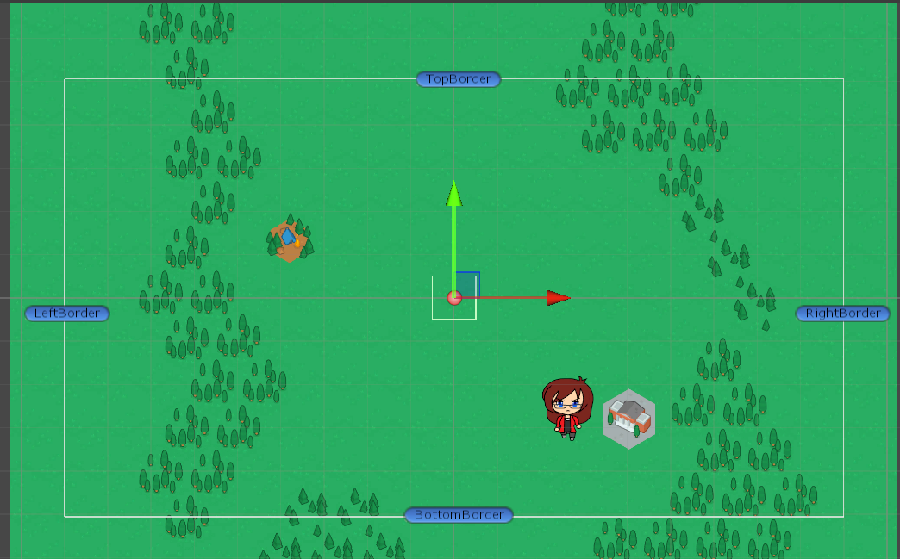
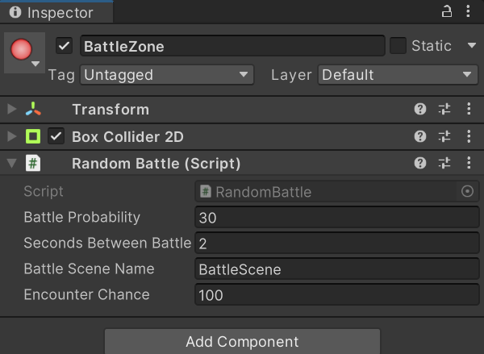

When creating scene(s) for battle, it needs to be considered whether one general reusable scene (with randomised contents for variation) is created or several scenes for various battle areas.

## Building the battle scene
Create a new scene called `BattleScene`, this scene will be loaded when a battle occurs. Setting up the scene with some background elements will make it feel more appropriate, adjust the *X* and *Y* scales as appropriate:


## Adding the initial enemy
To allow enemies in the battle scenes, a *prefab* needs to be created on which enemies can be created from. To create this, add an initial sprite to the scene:


With the enemy sprite in place, some logic needs to be added. Create a new animator controller called `DragonAI.controller` by right-clicking in the `Assets/Animation/Controllers` folder and selecting the appropriate option (`Create > Animator Controller`). Double click the new controller to open it in the **Animator** view.

With the controller created, add some parameters to control the state machine:

- `EnemiesInBattle`: int
- `PlayerHealth`: int
- `EnemyHealth`: int
- `PlayerSeen`: bool
- `PlayerAttacking`: bool

Then add the appropriate states for battles to the current animation layer:


With the parameters and states created, the transitions between the states need to be added:


- `Idle -> Attack` if `PlayerSeen == true`: Dragon attacks player when seen
- `Idle -> Defend` if `PlayerSeen == true && PlayerAttacking == true`: If player attacks and is seen, dragon defends
- `Attack -> Defend` if `PlayerAttacking == true`: Dragon defends if player attacks
- `Defend -> Attack` if `PlayerAttacking == false`: If player stops attacking, dragon attacks
- `Any State -> Idle` if `PlayerSeen == false`: If the dragon cannot see the player, drag idles
- `Any State -> Run Away` if `EnemyHealth < 2 && PlayerHealth > 2`: Dragon runs away if health drops too low and player health is good

With the animation controller created, drag it from the assets on to the enemy to add it as an `Animator` component:


With the enemy sprite up, a prefab can be created from it by dragging the game object into the `Assets/Prefabs/Characters` folder. The instance in the scene can then be deleted.

## Spawning the enemies
With the enemy prefab(s) created, the ability to spawn the enemies into the scene now needs adding. This can be done by creating *spawn points*.

First, create an empty object called `SpawnPoints` and set its position to `(0, 0, 0)`. This will act as a container for the actual spawn points. Create an empty child inside it called `SpawnPoint1` and give it a display icon, then duplicate this as many times as needed and place the spawn points in appropriate locations:


With the spawn points set up, a `BattleManager` script can be added which will make the enemies appear. This script will manage the battle scenes life cycle, including:

- Preparing the scene
- Taking turns to attack
- Finalising the battle scene
- etc...

Inside the script, add some variables that can be configured from the scene:

```c#
public class BattleManager : MonoBehaviour
{
    [SerializeField] private GameObject[] spawnPoints;
    [SerializeField] private GameObject[] enemyPrefabs;
    [SerializeField] private AnimationCurve spawnAnimationCurve;
}
```

- The `AnimationCurve` is used to control how the dragons are animated

Some control variables are also required for managing the battle:

```c#
private int enemyCount;
private BattlePhase phase;

enum BattlePhase
{
    PLAYER_ATTACK,
    ENEMY_ATTACK
}
```

The amount of enemies in the battle is kept track of, alongside the current phase of the battle. When the script runs, the `Start()` method is used to initialise the battle scene:

```c#
private void Start()
{
    enemyCount = Random.Range(1, spawnPoints.Length);
    StartCoroutine(SpawnEnemies());
    battlePhase = BattlePhase.PLAYER_ATTACK;
}
```

The coroutine for spawning the enemies looks like:

```c#
private IEnumerator SpawnEnemies()
{
    // spawn enemies over time
    for (int i = 0; i < enemyCount; i++)
    {
        GameObject enemy = Instantiate(enemyPrefabs[0]);
        enemy.transform.position = new Vector3(10, -1, 0);

        yield return StartCoroutine(
            MoveCharacterToPoint(spawnPoints[i], enemy)
        );
        enemy.transform.parent = spawnPoints[i].transform;
    }
}
```

When each new enemy instance is created, it is spawned off screen and then animated on to the screen with another coroutine (`MoveCharacterToPoint`). Once the coroutine finishes the animation, the enemy is anchored to its spawn point. The `spawnAnimationCurve` is used in the `MoveCharacterToPoint` method to move the dragon from off-screen to its spawn point:

```c#
private IEnumerator MoveCharacterToPoint(GameObject destination, GameObject enemy)
{
    float timer = 0f;
    Vector3 startPosition = enemy.transform.position;

    // if there are keyframes in the animation
    if (spawnAnimationCurve.length > 0)
    {
        // while there are still animation keys to be iterated upon
        while (timer < spawnAnimationCurve.keys[spawnAnimationCurve.length - 1].time)
        {
            // adjust the enemy position using the animation curve to control its time and rate
            enemy.transform.position = Vector3.Lerp(
                startPosition, destination.transform.position, spawnAnimationCurve.Evaluate(timer)
            );
            timer += Time.deltaTime;
            // wait until next frame is ready for each animation step to prevent animation occurring all at once
            yield return new WaitForEndOfFrame();
        }
    }
    else
    {
        enemy.transform.position = destination.transform.position;
    }
}
```

## Creating the battle manager
The `BattleManager` script now needs assigning to an empty game object in the scene:



With the script attached, the spawn points for the enemies and the enemy prefabs can be dragged into their respective arrays on the script:



The last thing to do is to setup the animation curve. Clicking the grey box will open a **Curve** window, select the appropriate curve.

## Allowing the player to run away
To allow the player to run away, a UI button will be added to the scene. Create a button and set its anchor and pivot point as appropriate (top-left in this case):



Add a `CanvasGroup` component to the `Canvas` in the battle scene to allow adjusting its interactivity and visibility. By default, it should be invisible and unable to be interacted with:

- Set `alpha` to `0`
- Deselect `Interactable` and `Block Raycasts`

Now, some logic will be added to make the button visible only when it is the players turn to attack. In the `BattleManager` script, add the field:

```c#
[SerializeField] private CanvasGroup buttons;
```

Add the `Update()` method with the following implementation to turn the button on and off depending on whether the player is attacking (players turn) or not:

```c#
private void Update()
{
    if (battlePhase == BattlePhase.PLAYER_ATTACK)
    {
        buttons.alpha = 1;
        buttons.interactable = true;
        buttons.blocksRaycasts = true;
    }
    else
    {
        buttons.alpha = 0;
        buttons.interactable = false;
        buttons.blocksRaycasts = false;
    }
}

public void RunAway()
{
    NavigationManager.NavigateTo("Overworld");
}
```

Now, attach the canvas to the `buttons` element of the `BattleManager` objects script in the editor. Then set the run away buttons on click function as the `RunAway()` method on the `BattleManager` objects attached script:



## Starting a battle
With the battle scene setup, a way for a battle to start needs to be added. In this case, it will be done on the `Overworld` scene by adding battle areas which have higher probabilities of encountering a battle.

In the `Overworld` scene, create an empty game object called `BattleZones`, create an empty child object called `BattleZone` inside of it. Add a `BoxCollider2D` component, with `IsTrigger` set to `true`, to the `BattleZone` and give the zone an icon:



Now, create a script called `RandomBattle` which will be attached to the `BattleZone` object(s) to trigger a battle. In the script, declare some fields that will be used to calculate when a battle should occur:

```c#
public class RandomBattle : MonoBehaviour
{
    [SerializeField] private int battleProbability;
    [SerializeField] private int secondsBetweenBattles;
    [SerializeField] private string battleSceneName;
    [SerializeField] private int encounterChance = 100;
}
```

- `battleProbability`: Represents the chance of a battle encounter in a zone.
- `encounterChance`: Holds a randomly generated number. If the value is less than or equal to `battleProbability`, a battle occurs.
- `secondsBetweenBattles`: Determines the amount of time that will pass before another battle can occur. After the time has elapsed, `encounterChance` will be assigned a new random number.
- `battleSceneName`: The string name of the scene that will load on a battle occurring.

To allow continually checking for whether a battle should occur or not when the player is inside the battle zone, the `OnTriggerEnter2D`, `OnTriggerStay2D`, and `OnTriggerExit2D` methods of `MonoBehaviour` will be utilised:

```c#
private void OnTriggerEnter2D(Collider2D collision)
{
    encounterChance = Random.Range(1, 100);
    if (encounterChance > battleProbability) StartCoroutine(RecalculateChance());
}

private void OnTriggerStay2D(Collider2D collision)
{
    if (encounterChance <= battleProbability)
    {
        Debug.Log("Battle started");
        SceneManager.LoadScene(battleSceneName);
    }
}

private void OnTriggerExit2D(Collider2D collision)
{
    encounterChance = 100;
    StopCoroutine(RecalculateChance());
}

private IEnumerator RecalculateChance()
{
    while (encounterChance > battleProbability)
    {
        yield return new WaitForSeconds(secondsBetweenBattles);
        encounterChance = Random.Range(1, 100);
    }
}
```

When the player enters the collision area, a random number is generated to determine if a battle occurs. If a battle does not occur, `RecalculateChance` is called to generate a random number for the `encounterChance`. As long as the player remains in the zone, battles will be attempted continually. Once the player exits the zone, battle attempts will stop.

Attach the `RandomBattle` script to the `BattleZone` object and set its field values as necessary:



Now, create a prefab from the `BattleZone` object so that it can reused as needed. With the existing object, rename it to `Zone1` and resize its collision area as seems appropriate. Add any additional battle zones as deemed necessary.

Make sure to add the `BattleScene` to the build settings.

## Saving the map position
After the player enters a battle, whether they run or fight their last known position should be restored. This is known as the *last known position method*, although other ways of setting a position after the battle exists.

To implement this, things like the player's stats, options, preferences, and where they are in the world will be stored. This will also be useful for save functionality at a later point.

For this, a simple static `GameState` class can be used:

```c#
public static class GameState
{
    public static Player currentPlayer = ScriptableObject.CreateInstance<Player>();
    public static Dictionary<string, Vector3> lastScenePositions = new Dictionary<string, Vector3>();
}
```

- The `currentPlayer` class variable stores the tracked player instance, this holds the player related information
- The `lastScenePositions` variable is recording the scenes a player has visited and their last position registered in that scene

It can also be helpful to add helper methods for retrieving and setting a scenes last position:

```c#
public static Vector3 GetLastScenePosition(string scene)
{
    if (GameState.lastScenePositions.ContainsKey(scene))
    {
        return GameState.lastScenePositions[scene];
    }
    else return Vector3.zero;
}

public static void SetLastScenePosition(string scene, Vector3 position)
{
    if (GameState.lastScenePositions.ContainsKey(scene))
    {
        GameState.lastScenePositions[scene] = position;
    }
    else
    {
        GameState.lastScenePositions.Add(scene, position);
    }
}
```

Now, a `MapPosition` script can be created for the map to load the last position if one exists and save the last position upon scene exit:

```c#
public class MapPosition : MonoBehaviour
{
    private void Awake()
    {
        Vector3 lastPosition = GameState.GetLastScenePosition(SceneManager.GetActiveScene().name);
        if (lastPosition != Vector3.zero) transform.position = lastPosition;
    }

    private void OnDestroy()
    {
        GameState.SetLastScenePosition(SceneManager.GetActiveScene().name, transform.position);
    }
}
```

When the script is loaded in a scene, it sets the position. On scene exit, it sets the last scenes position. This script can then be attached to the `Player` prefab so that it updates all instance of the player, allowing them to spawn appropriately.

## Prevent battles from accidently immediately occurring
As the players position is restored, this may accidently cause another battle scene to immediately occur in certain occasions.

To resolve this, add a class variable to the `GameState` script to hold if a battle has just been exited or not:

```c#
public static bool recentlyExitedBattle;
```

Then update the `RunAway` method of the `BattleManager` script to update this class variable:

```c#
public void RunAway()
{
    GameState.recentlyExitedBattle = true;
    NavigationManager.NavigateTo("Overworld");
}
```

Then update the `RandomBattle` script to account for whether this has occurred or not:

```c#
private void OnTriggerEnter2D(Collider2D collision)
{
    if (GameState.recentlyExitedBattle)
    {
        StartCoroutine(RecalculateChance());
        GameState.recentlyExitedBattle = false;
    }
    else
    {
        encounterChance = Random.Range(1, 100);
        if (encounterChance > battleProbability) StartCoroutine(RecalculateChance());
    }
}
```

## Fixing travel between scenes
With the ability to save map positions added, this will cause the game to trigger switches between scenes rapidly when travelling due to the last positions of each scene being on the colliders which initiate travel.

To fix this, first add a variable to indicate whether the last position should be saved to the `GameState` script:

```c#
public static bool saveLastPosition = true;
```

The adjust the `MapPosition.OnDestroy` method to only save the last position if this variable is true:

```c#
private void OnDestroy()
{
    if (GameState.saveLastPosition)
    {
        GameState.SetLastScenePosition(SceneManager.GetActiveScene().name, transform.position);
    }
}
```

Then add a variable to record the starting position to the `NavigationPrompt` script:

```c#
public Vector3 startingPosition;
```

Then update both trigger methods in the same script to account for whether the last position should be saved or not:

```c#
private void OnCollisionEnter2D(Collision2D collision)
{
    if (NavigationManager.CanNavigate(this.tag))
    {
        GameState.saveLastPosition = false;
        GameState.SetLastScenePosition(SceneManager.GetActiveScene().name, startingPosition);

        Debug.Log("Attempting to exit via " + this.tag);
        NavigationManager.NavigateTo(this.tag);
    }
}

private void OnTriggerEnter2D(Collider2D collision)
{
    if (NavigationManager.CanNavigate(tag))
    {
        GameState.saveLastPosition = false;
        GameState.SetLastScenePosition(SceneManager.GetActiveScene().name, startingPosition);

        Debug.Log("Attempting to exit via " + tag);
        NavigationManager.NavigateTo(tag);
    }
}
```

Then, in the Unity Editor set the `startingPosition`'s value as appropriate for objects which have this script attached.

To account for `GameState.saveLastPosition` being set to `false` when travelling between scenes, it needs to be updated to `true` when a battle occurs to allow the position prior to battle to be restored appropriately. Update `RandomBattle.OnTriggerStay2D` to resolve this:

```c#
private void OnTriggerStay2D(Collider2D collision)
{
    if (encounterChance <= battleProbability)
    {
        Debug.Log("Battle started");
        GameState.saveLastPosition = true;
        SceneManager.LoadScene(battleSceneName);
    }
}
```

