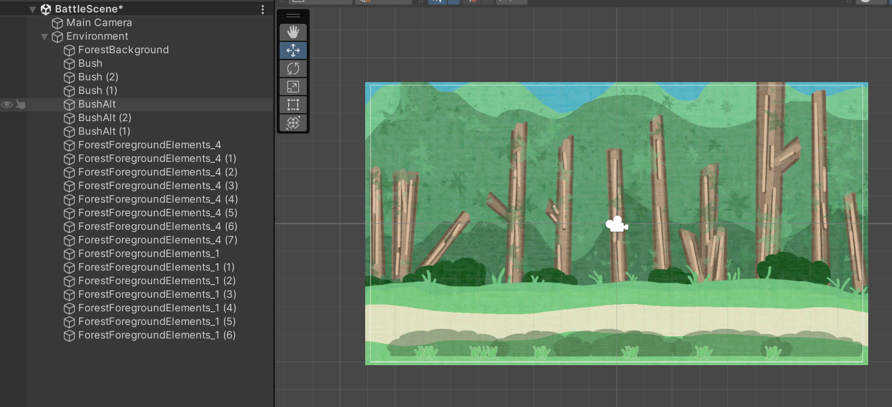
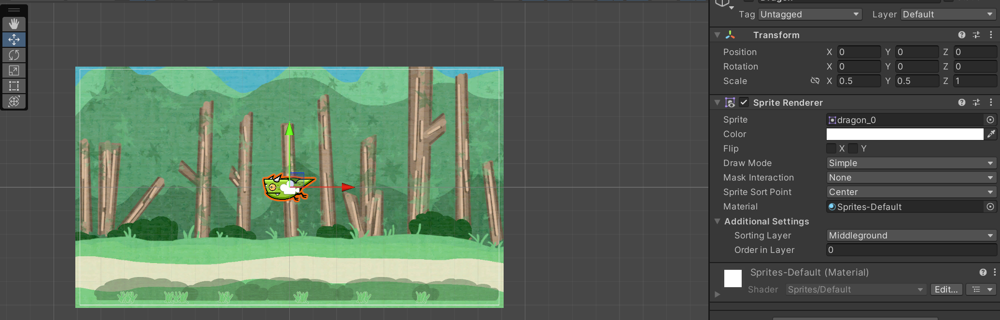
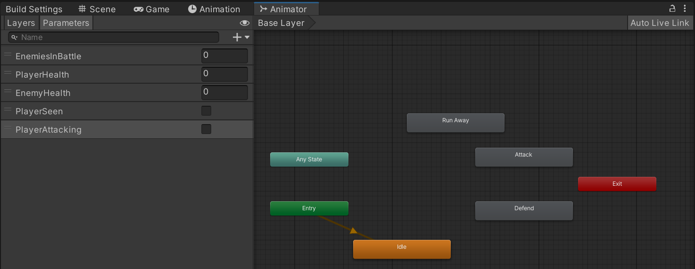
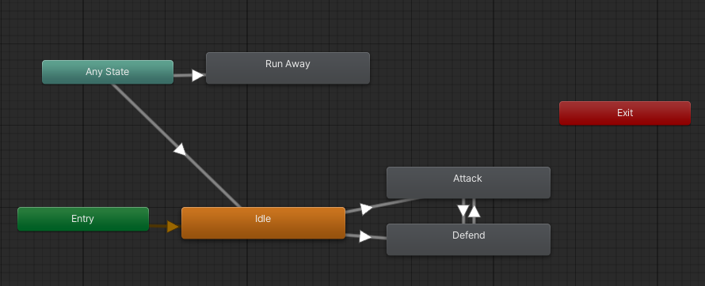
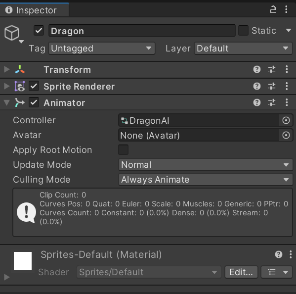
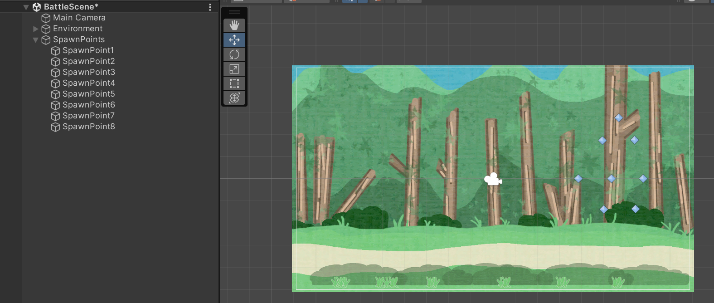

When creating scene(s) for battle, it needs to be considered whether one general reusable scene (with randomised contents for variation) is created or several scenes for various battle areas.

## Building the battle scene
Create a new scene called `BattleScene`, this scene will be loaded when a battle occurs. Setting up the scene with some background elements will make it feel more appropriate, adjust the *X* and *Y* scales as appropriate:



## Adding the initial enemy
To allow enemies in the battle scenes, a *prefab* needs to be created on which enemies can be created from. To create this, add an initial sprite to the scene:



With the enemy sprite in place, some logic needs to be added. Create a new animator controller called `DragonAI.controller` by right-clicking in the `Assets/Animation/Controllers` folder and selecting the appropriate option (`Create > Animator Controller`). Double click the new controller to open it in the **Animator** view.

With the controller created, add some parameters to control the state machine:

- `EnemiesInBattle`: int
- `PlayerHealth`: int
- `EnemyHealth`: int
- `PlayerSeen`: bool
- `PlayerAttacking`: bool

Then add the appropriate states for battles to the current animation layer:



With the parameters and states created, the transitions between the states need to be added:



- `Idle -> Attack` if `PlayerSeen == true`: Dragon attacks player when seen
- `Idle -> Defend` if `PlayerSeen == true && PlayerAttacking == true`: If player attacks and is seen, dragon defends
- `Attack -> Defend` if `PlayerAttacking == true`: Dragon defends if player attacks
- `Defend -> Attack` if `PlayerAttacking == false`: If player stops attacking, dragon attacks
- `Any State -> Idle` if `PlayerSeen == false`: If the dragon cannot see the player, drag idles
- `Any State -> Run Away` if `EnemyHealth < 2 && PlayerHealth > 2`: Dragon runs away if health drops too low and player health is good

With the animation controller created, drag it from the assets on to the enemy to add it as an `Animator` component:



With the enemy sprite up, a prefab can be created from it by dragging the game object into the `Assets/Prefabs/Characters` folder. The instance in the scene can then be deleted.

## Spawning the enemies
With the enemy prefab(s) created, the ability to spawn the enemies into the scene now needs adding. This can be done by creating *spawn points*.

First, create an empty object called `SpawnPoints` and set its position to `(0, 0, 0)`. This will act as a container for the actual spawn points. Create an empty child inside it called `SpawnPoint1` and give it a display icon, then duplicate this as many times as needed and place the spawn points in appropriate locations:



With the spawn points set up, a `BattleManager` script can be added which will make the enemies appear. This script will manage the battle scenes life cycle, including:

- Preparing the scene
- Taking turns to attack
- Finalising the battle scene
- etc...

Inside the script, add some variables that can be configured from the scene:

```c#
public class BattleManager : MonoBehaviour
{
    [SerializeField] private GameObject[] spawnPoints;
    [SerializeField] private GameObject[] enemyPrefabs;
    [SerializeField] private AnimationCurve spawnAnimationCurve;
}
```

- The `AnimationCurve` is used to control how the dragons are animated

Some control variables are also required for managing the battle:

```c#
private int enemyCount;
private BattlePhase phase;

enum BattlePhase
{
    PLAYER_ATTACK,
    ENEMY_ATTACK
}
```

The amount of enemies in the battle is kept track of, alongside the current phase of the battle. When the script runs, the `Start()` method is used to initialise the battle scene:

```c#
private void Start()
{
    enemyCount = Random.Range(1, spawnPoints.Length);
    StartCoroutine(SpawnEnemies());
    battlePhase = BattlePhase.PLAYER_ATTACK;
}
```

The coroutine for spawning the enemies looks like:

```c#
private IEnumerator SpawnEnemies()
{
    // spawn enemies over time
    for (int i = 0; i < enemyCount; i++)
    {
        GameObject enemy = Instantiate(enemyPrefabs[0]);
        enemy.transform.position = new Vector3(10, -1, 0);

        yield return StartCoroutine(
            MoveCharacterToPoint(spawnPoints[i], enemy)
        );
        enemy.transform.parent = spawnPoints[i].transform;
    }
}
```

When each new enemy instance is created, it is spawned off screen and then animated on to the screen with another coroutine (`MoveCharacterToPoint`). Once the coroutine finishes the animation, the enemy is anchored to its spawn point. The `spawnAnimationCurve` is used in the `MoveCharacterToPoint` method to move the dragon from off-screen to its spawn point:

```c#
private IEnumerator MoveCharacterToPoint(GameObject destination, GameObject enemy)
{
    float timer = 0f;
    Vector3 startPosition = enemy.transform.position;

    // if there are keyframes in the animation
    if (spawnAnimationCurve.length > 0)
    {
        // while there are still animation keys to be iterated upon
        while (timer < spawnAnimationCurve.keys[spawnAnimationCurve.length - 1].time)
        {
            // adjust the enemy position using the animation curve to control its time and rate
            enemy.transform.position = Vector3.Lerp(
                startPosition, destination.transform.position, spawnAnimationCurve.Evaluate(timer)
            );
            timer += Time.deltaTime;
            // wait until next frame is ready for each animation step to prevent animation occurring all at once
            yield return new WaitForEndOfFrame();
        }
    }
    else
    {
        enemy.transform.position = destination.transform.position;
    }
}
```

## Creating the battle manager
