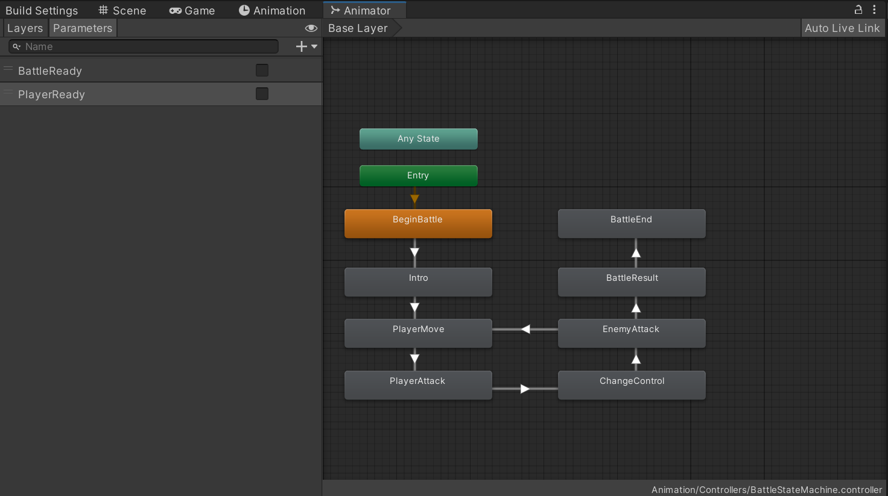

Turn-based battle systems require a system to handle the turns that are taken between players and enemies. A management class for this can be utilised.

## Creating the battle state manager
First, a state machine should be created to handle the different battle states. This can be done utilising the Mecanim animation system.

Create a new animator controller called `BattleStateMachine` in the `Assets/Animation/Controller` folder:



The transitions are defined as:

- `BeginBattle` -> `Intro`:
	- `BattleReady` = `true`
	- `Has Exit Time` = `false`
	- `Transition Duration` = `0`
- `Intro` -> `PlayerMove`:
	- `Has Exit Time` = `true`
	- `Exit Time` = `0.9`
	- `Transition Duration` = `2`
- `PlayerMove` -> `PlayerAttack`:
	- `PlayerReady` = `true`
	- `Has Exit Time` = `false`
	- `Transition Duration` = `0`
- `PlayerAttack` -> `ChangeControl`:
	- `PlayerReady` = `false`
	- `Has Exit Time` = `false`
	- `Transition Duration` = `2`
- `ChangeControl` -> `EnemyAttack`:
	- `Has Exit Time` = `true`
	- `Exit Time` = `0.9`
	- `Transition Duration` = `2`
- `EnemyAttack` -> `PlayerMove`:
	- `BattleReady` = `true`
	- `Has Exit Time` = `false`
	- `Transition Duration` = `2`
- `EnemyAttack` -> `BattleResult`:
	- `BattleReady` = `false`
	- `Has Exit Time` = `false`
	- `Transition Duration` = 2
- `BattleResult` -> `BattleEnd`:
	- `Has Exit Time` = `true`
	- `Exit Time` = `0.9`
	- `Transition Duration` = `5`

With the states set up, the animator controller needs to be attached to the `BattleManager` game object in the game scene:

1. Open the `BattleScene`
2. Select `BattleManager` object and add an `Animator` component
3. Drag the `BattleStateMachine` animator controller into the `Controller` property of the new animator component

Then, open the `BattleManager` script and add a reference to the `BattleStateMachine` Mecanim state machine:

```c#
private Animator battleStateManager;
```

To initialise this field, add the `Awake` method to capture the desired `Animator` component:

```c#
private void Awake()
{
    battleStateManager = GetComponent<Animator>();
    if (battleStateManager == null) Debug.LogError("No battleStateMachine Animator found.");
}
```

