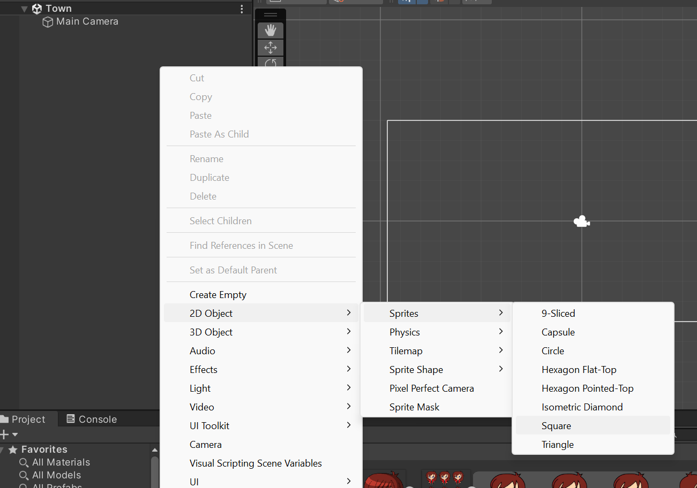
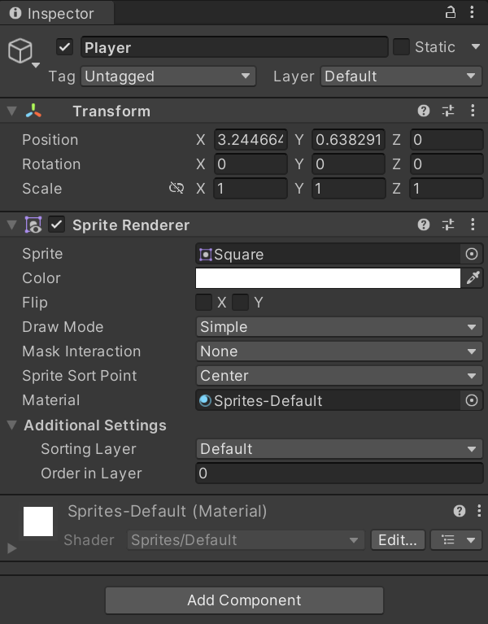

Every object in a scene is a `GameObject` in Unity, each `GameObject` is just a container for holding a list of `Component`s. A `Component` represents a set of individual properties that make a `GameObject` unique and are viewable from the **Inspector**.

The most basic is an empty `GameObject`, it will have no components other than a `Transform` component. The `Transform` component is essential to all game objects, allowing them to have a physical location, rotation, and scale in the scene.

In 2D games, the majority of the game objects will be a `Sprite` object.

## Sprite GameObjects
A Sprite object can be created by right-clicking in the hierarchy, and then selecting `2D Object > Sprites > xxx` where `xxx` is the desired shape:

The new game object will have two default components, the `Transform` and `Sprite Renderer`:

