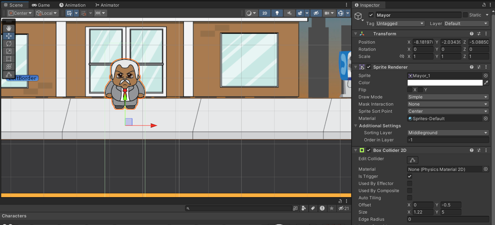
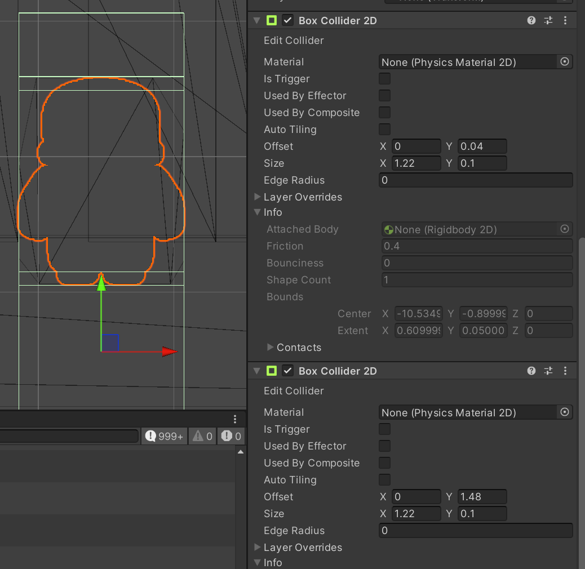

To create a conversation system, some NPCs will be necessary. Some additional logic will also need to be created to handle the player moving around the NPCs.

First, add an NPC that is desired:

1. Add the NPC sprite sheet and slice it up if required
2. Drag the desired sprite on to the scene
3. Rename the new game object to be appropriate
4. In the **Sprite Renderer** component, set the sorting layer to the same as the player (**Middleground**)
5. Add a **Box Collider 2D** component to the NPC. The collider will be the same width as the NPC, but with a larger height so that player collides with the NPC when walking in front of them. Set the **Is Trigger** property to `true` so that any collisions can be detected.



## Allow the player to walk around the NPC
If the player has the same sorting layer and order in layer as the new NPC, the player will appear behind the NPC whether they walk in front or behind them. Setting the NPCs order in layer to `-1` so that the player always appears in front of the NPC works when the player walks in front of the NPC, but it doesn't look appropriate when the player walks behind the NPC as they appear on top of them.

To work around this, a custom `Sorting` script can be created to check the positions player versus the position of the object on which the script is attached. In the script, it can then adjust the sorting order to place the player in front of or behind the NPC:

```c#
public class Sorting : MonoBehaviour
{
    [SerializeField]
    private Transform player;

    private void Awake()
    {
        player = GameObject.Find("Player").transform;
    }

    // Update is called once per frame
    void Update()
    {
        if (transform.position.y >= player.transform.position.y)
        {
            Debug.Log(name + " is behind the player");
            GetComponent<SpriteRenderer>().sortingOrder = (player.GetComponent<SpriteRenderer>().sortingOrder) - 1;
        } else if (transform.position.y < player.transform.position.y)
        {
            Debug.Log(name + " is in front of the player");
            GetComponent<SpriteRenderer>().sortingOrder = (player.GetComponent<SpriteRenderer>().sortingOrder) + 1;
        }
    }
}
```

This script should then be attached to the NPC to allow sorting the layer order when the player collides with the NPC.

### Preventing the player from walking through the NPC
The current script does sort the layer order of the NPC relative to the player, but it currently allows the player to walk through the NPC. This can be prevented by using box colliders.

Currently, the NPC has a box collider component with `Is Trigger` set to `true`, this collider will be used to trigger a dialog box but it does not stop the player from passing through the NPC.

A new box collider could be added, but it would prevent the character from being able to walk around the NPC. Instead, two new `Box Collider 2D` components should be added to the NPC. These will be turned on and off depending on the players location relative to the NPC:



Once these colliders have been added, the `Sorting` script needs to be modified to account for these new colliders. To access them, `GetComponents<BoxCollider2D>` can be used. This will return an array of the colliders in the order that they appear in the **Inspector**:

```c#
public class Sorting : MonoBehaviour
{
    [SerializeField]
    private Transform player;

    private void Awake()
    {
        player = GameObject.Find("Player").transform;
    }

    // Update is called once per frame
    void Update()
    {
        if (transform.position.y >= player.transform.position.y)
        {
            Debug.Log(name + " is behind the player");
            GetComponent<SpriteRenderer>().sortingOrder = (player.GetComponent<SpriteRenderer>().sortingOrder) - 1;

            GetComponents<BoxCollider2D>()[1].enabled = false;
            GetComponents<BoxCollider2D>()[2].enabled = true;
        } else if (transform.position.y < player.transform.position.y)
        {
            Debug.Log(name + " is in front of the player");
            GetComponent<SpriteRenderer>().sortingOrder = (player.GetComponent<SpriteRenderer>().sortingOrder) + 1;

            GetComponents<BoxCollider2D>()[1].enabled = true;
            GetComponents<BoxCollider2D>()[2].enabled = false;
        }
    }
}
```