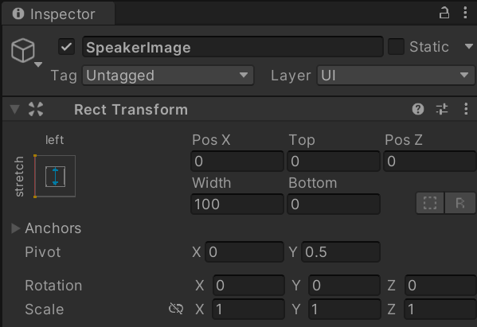

For conversation assets to be of use, a mechanism is needed for displaying the conversations on the screen another for allowing user interaction where needed. A manager will be used to display a characters conversation on the screen, any logic, branching, or decisions would also be handled by the manager.

There are two basic approaches:

- Reactive: Messaging system is used to notify the manager that a conversation needs to take place
- Utility: Scripts request for a conversation to take place

Approach explored here is the *utility* approach.

## The manager
To create a conversation manager, it will be built using a singleton. The Unity Wiki provides a `Singleton` superclass that can be used to make this process easier:

```c#
using UnityEngine;
/// <summary>
/// Be aware this will not prevent a non singleton constructor
///   such as `T myT = new T();`
/// To prevent that, add `protected T () {}` to your singleton class.
/// 
/// As a note, this is made as MonoBehaviour because we need Coroutines.
/// </summary>
public class Singleton<T> : MonoBehaviour where T : MonoBehaviour
{
    private static T _instance;

    private static object _lock = new object();

    public static T Instance
    {
        get
        {
            if (applicationIsQuitting)
            {
                Debug.LogWarning("[Singleton] Instance '" + typeof(T) +
                    "' already destroyed on application quit." +
                    " Won't create again - returning null.");
                return null;
            }

            lock (_lock)
            {
                if (_instance == null)
                {
                    _instance = (T)FindObjectOfType(typeof(T));

                    if (FindObjectsOfType(typeof(T)).Length > 1)
                    {
                        Debug.LogError("[Singleton] Something went really wrong " +
                            " - there should never be more than 1 singleton!" +
                            " Reopenning the scene might fix it.");
                        return _instance;
                    }

                    if (_instance == null)
                    {
                        GameObject singleton = new GameObject();
                        _instance = singleton.AddComponent<T>();
                        singleton.name = "(singleton) " + typeof(T).ToString();

                        DontDestroyOnLoad(singleton);

                        Debug.Log("[Singleton] An instance of " + typeof(T) +
                            " is needed in the scene, so '" + singleton +
                            "' was created with DontDestroyOnLoad.");
                    }
                    else
                    {
                        Debug.Log("[Singleton] Using instance already created: " +
                            _instance.gameObject.name);
                    }
                }

                return _instance;
            }
        }
    }

    private static bool applicationIsQuitting = false;
    /// <summary>
    /// When Unity quits, it destroys objects in a random order.
    /// In principle, a Singleton is only destroyed when application quits.
    /// If any script calls Instance after it have been destroyed, 
    ///   it will create a buggy ghost object that will stay on the Editor scene
    ///   even after stopping playing the Application. Really bad!
    /// So, this was made to be sure we're not creating that buggy ghost object.
    /// </summary>
    public void OnDestroy()
    {
        applicationIsQuitting = true;
    }
}
```

Store this in `Assets/Scripts/Classes`, this saves time and reduces code duplication when creating singleton objects in the game.

Once added, create a `ConversationManager` class in the `Assets\Scripts` folder that extends the singleton class. Provide a default protected constructor to prevent accidental instantiation of the type:

```c#
public class ConversationManager : Singleton<ConversationManager>
{
    protected ConversationManager() { }
}
```

## Starting a conversation
The manager needs to be able to take a conversation item and do something with it, add a method to it for starting conversations:

```c#
public class ConversationManager : Singleton<ConversationManager>
{
    protected ConversationManager() { }

    public void StartConversation(Conversation conversation) { }
}
```

A conversation can then be started anywhere in the code base using:

```c#
ConversationManager.Instance.StartConversation(conversation);
```

## Preparing the UI
The managers `StartConversation()` method doesn't do anything yet. To make use of it, a UI for conversations will be needed.

Within the scene, create a **Canvas** game object if one does not yet exist. Then right-click the new canvas object and select **UI > Panel**, double-click the new panel object to focus it in the scene editor:


Rename it as `DialogBox`, the panel will be used to hold the text and image related to the current conversation.

The panel needs to be made smaller, to prevent it taking up the whole scene. Do this by setting the **Anchor** and **Pivot Point** to center-middle, do this by holding `ALT+SHIFT` and selecting the middle anchor preset. Then set the width and height to `300` and `100`:


Pressing play will show the panel over the game view:


Now, right-click the panel in the hierarchy and add a **UI > Image** object and a **UI > Text** object:


The image will be made to appear on the left and the text on the right, their height will also be stretched to fill the height of the panel. 

First, rename the image to `SpeakerImage` and give it the following settings:



Then rename the text box to `DialogText` and give it the following settings:


Then change the image settings to make the dialog box more opaque. Select the **Color** property on the **Image** component of the dialog box, increase the **A** (alpha) value to `230` to add some transparency:


Now, to hide the dialog box by default, add a **Canvas Group** component to the `DialogBox` object. Change the settings to as follows:


## Displaying the conversation
With a UI present to display text on, the logic behind it can start to be created.

In the `ConversationManager`, add the following fields to control what is displayed:

```c#
bool isTalking = false;
ConversationEntry currentConversationLine;
public CanvasGroup dialogBox;
public Image imageHolder;
public Text textHolder;
```

- Add `using UnityEngine.UI;` to the top of the script to make use of the UI elements in code.

Then add a `DisplayConversation` coroutine method which accepts a `Conversation` object and loops through all the lines to display:

```c#
IEnumerator DisplayConversation(Conversation conversation)
{
    isTalking = true;

    foreach (ConversationEntry line in conversation.conversationLines)
    {
        currentConversationLine = line;
        textHolder.text = currentConversationLine.ConversationText;
        imageHolder.sprite = currentConversationLine.DisplayPicture;
        yield return new WaitForSeconds(3);
    }

    isTalking = false;
}
```

Then add another method to the `ConversationManager` to display the conversation on the screen when it is active:

```c#
void OnGUI()
{
    if (isTalking)
    {
        dialogBox.alpha = 1;
        dialogBox.blocksRaycasts = true;
    } else
    {
        dialogBox.alpha = 0;
        dialogBox.blocksRaycasts = false;
    }
}
```

This unhides the dialog box when `isTalking` is `true`, and hides it otherwise. The `OnGUI` method is automatically invoked when changes to the UI are made.

To utilise these helper methods, the `StartConversation` method should be given the following implementation:

```c#
public void StartConversation(Conversation conversation) 
{
    dialogBox = GameObject.Find("DialogBox").GetComponent<CanvasGroup>();
    imageHolder = GameObject.Find("SpeakerImage").GetComponent<Image>();
    textHolder = GameObject.Find("DialogText").GetComponent<Text>();

    if (!isTalking) StartCoroutine(DisplayConversation(conversation));
}
```

This finds the appropriate game objects, the dialog box and its children, and then starts the conversation coroutine if a conversation is not already occurring.

## Connecting the conversation manager to the NPCs
Now, the conversation manager can be attached to the characters to start displaying it on the screen for player interaction.

First, an empty `NPC` class needs to be created in the `Assets/Scripts/Classes` folder:

```c#
public class NPC : MonoBehaviour
{
    public new string name;
    public int age;
    public string faction;
    public string occupation;
    public int level;
}
```

- NPC inherits from `MonoBehaviour` instead of `Entity` as only scripts derived from `MonoBehaviour` can be attached to game objects in a scene.

Then attach the script to the desired NPC in the scene, setting any properties as desired in the inspector. Follow this up by adding the `Conversation` component to the NPC as well, dragging the conversation asset onto it:


With the NPC and conversation components set up, all that is left is to trigger the conversation. In this case, when the player tries to exit the left side of the town.

Add the `MessagingClientBroadcast` script to the NPC. As the NPC has a Box Collider 2D on it set as a trigger, update the the `MessagingClientBroadcast` script to include:

```c#
public class MessagingClientBroadcast : MonoBehaviour
{
    private void OnTriggerEnter2D(Collider2D collision)
    {
        if (collision == null) return;
        MessagingManager.Instance.Broadcast();
    }
}
```

This will trigger a message to be broadcast to any subscribers of the component, in this case the player walking in front of the NPC.

Now, add the `MessagingClientReceiver` script to the NPC. Update the script as follows:

```c#
public class MessagingClientReceiver : MonoBehaviour
{
    void Start()
    {
        MessagingManager.Instance.Subscribe(ThePlayerIsTryingToLeave);
    }

    void ThePlayerIsTryingToLeave()
    {
        ConversationComponent dialog = GetComponent<ConversationComponent>();

        if (dialog != null)
        {
            if (dialog.conversations != null && dialog.conversations.Length > 0)
            {
                Conversation conversation = dialog.conversations[0];
                if (conversation != null)
                {
                    ConversationManager.Instance.StartConversation(conversation);
                }
            }
        }
    }
}
```

> This is a simple example, it should be extended in a full system to track conversations that are played or conditions that need to be met for a conversation to play. Currently, the conversation will keep playing even if the vicinity of the character being talked to has been left.

Finally, create an empty game object and name it `MessagingManager`. Then attach the `MessagingManager` script to it.