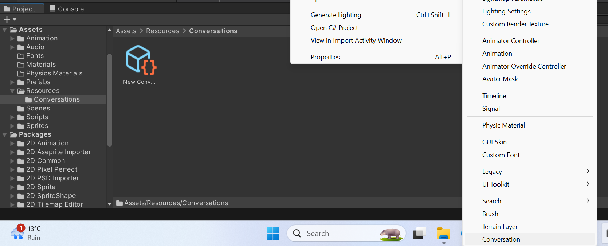
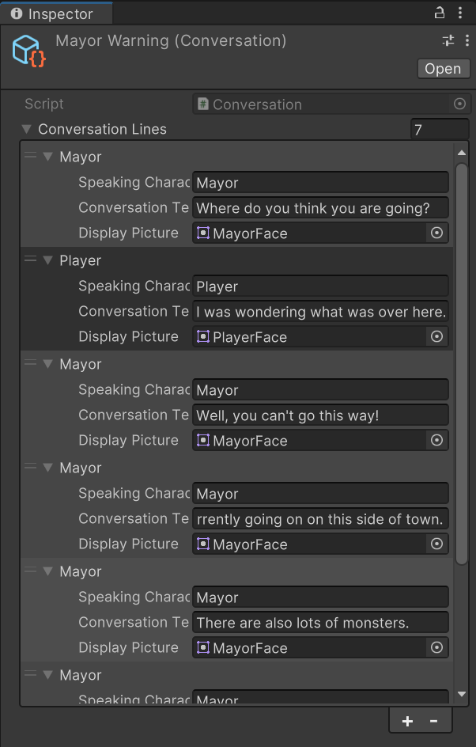

Once some NPCs have been added, a conversation system can start to be built out for the game. There are many things to consider when building the system though:

- How long will a conversation be?
- How many parties are to be involved in the discussion?
- Is it a one-sided conversation (like a cutscene), or will the player be able to make decisions?
- Will the conversation have branches, different paths it could take based on player responses?
- How much content will be used in conversations (text, video, cutscenes, animations, etc...)?
- Will the conversation need to support any outbound triggers or states (like unlocking a door, granting the player a reward, etc...)?

## The conversation object
When introducing dialogue in a game, what needs to be included needs to be decided. Common things include:

- Name of the character speaking
- Text of the conversation
- Image of the character talking
- Choices
- Chat position

A possible conversation type, placed in `Assets/Scripts/Classes` might look like:

```c#
[System.Serializable]
public class ConversationEntry
{
    public string SpeakingCharacterName;
    public string ConversationText;
    public Sprite DisplayPicture;
}
```

This would provide the basics for the conversation system with regards to who is speaking, an optional picture, and the text to be displayed. The class is tagged as serializable so the Unity serializer can understand it.

## Saving and serializing the object for later
Once the core conversation object exists, conversations can be stored with the `.asset` files used in the game.

As conversations consist of more than one line, a management object will be required to support multiple conversation entries and switches to indicate whether the conversation has already been played. To represent a conversation, a `Conversation` type can be added to the `Scripts/Classes` folder:

```c#
public class Conversation : ScriptableObject
{
	public ConversationEntry[] conversationLines;
}
```

This class is derived from `ScriptableObject`, which allows Unity to serialize it and store it in an `.asset` file.

Finally, a hook needs to be created to allow creating the conversations in the editor. To ease this process, a `CustomAssetUtility` class can be created to reduce the duplication of serialization code throughout the project:

```c#
using System.IO;
using UnityEditor;
using UnityEngine;

public static class CustomAssetUtility {

    public static void CreateAsset<T>() where T : ScriptableObject
    {
        string path = AssetDatabase.GetAssetPath(Selection.activeObject);
        if (path == "")
        {
            path = "Assets";
        }
        else if (Path.GetExtension(path) != "")
        {
            path = path.Replace(Path.GetFileName(AssetDatabase.GetAssetPath(Selection.activeObject)), "");
        }
        CreateAsset<T>(path);
    }

    public static void CreateAsset<T>(string path) where T : ScriptableObject
    {
        T asset = ScriptableObject.CreateInstance<T>();

        string assetPathAndName = AssetDatabase.GenerateUniqueAssetPath(path + "/New " + typeof(T).ToString() + ".asset");

        AssetDatabase.CreateAsset(asset, assetPathAndName);

        AssetDatabase.SaveAssets();
        EditorUtility.FocusProjectWindow();
        Selection.activeObject = asset;
    }
}
```

- Add this to the `Assets/Scripts/Editor` folder

Now, the editor script can be created which creates the conversation assets. Create a `ConversationAssetCreator` script in the `Assets/Scripts/Editor` folder:

```c#
using UnityEngine;
using UnityEditor;

public class ConversationAssetCreator : MonoBehaviour
{
    [MenuItem("Assets/Create/Conversation")]
    public static void CreateAsset()
    {
        CustomAssetUtility.CreateAsset<Conversation>();
    }
}
```

Then create a folder in the Unity editor called `Assets/Resources/Conversations` to store assets in that can be directly called from code. Now, right click in the project assets and select `Create > Conversation` to create a new conversation asset in the currently selected folder:



Rename the conversation asset as is appropriate, then select it and edit its lines and images as needed in the **Inspector** view:



## The conversation component
The last thing needed is the component which enables attaching conversations to a character or other game object. Create a new class in `Assets/Scripts/Classes` called `ConversationComponent`:

```c#
public class ConversationComponent : MonoBehaviour
{
    public Conversation[] conversations;
}
```

This just holds an array of possible conversations that the game object can have. Ideally, this would be expanded with pointers to the next conversation, or a way to track the conversations that have occurred, etc...