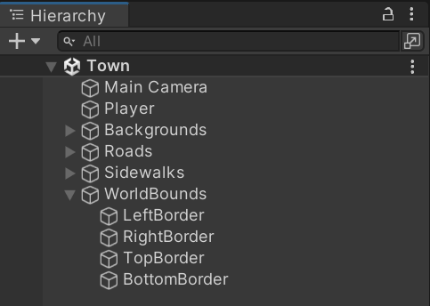
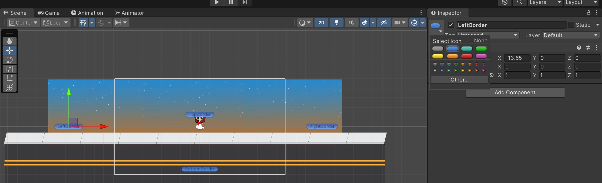
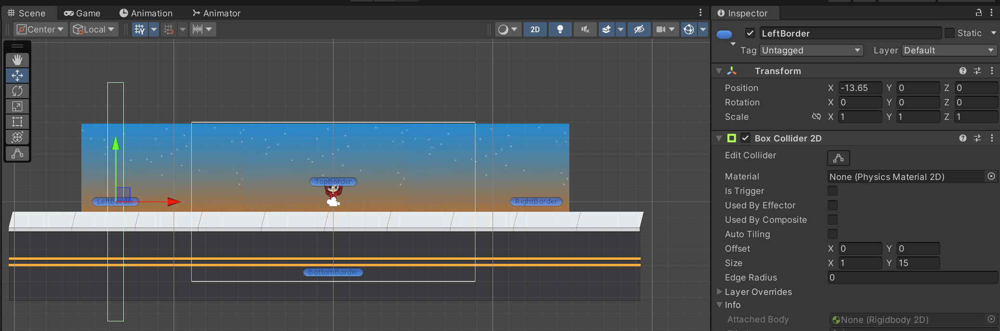
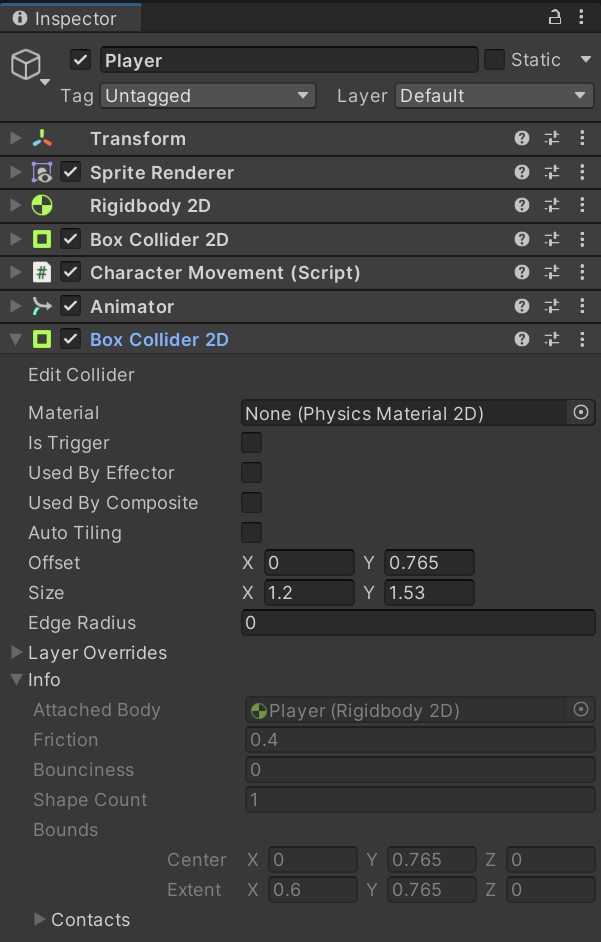
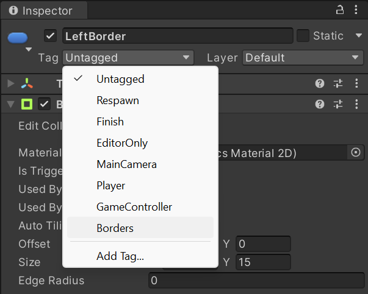

Currently, the camera follows the player but the player is still allowed to walk off the screen and out of the desired bounds of the game.

## Adding borders
There are a variety of ways to add boundaries to a game, the simplest is to make use of the 2D physics system via the **Box2D** component. The 2D physics system is very fast, so it does not have much of an effect on the games performance alongside being simple to use.

The player already has a **RigidBody2D** applied to enable physics, and a **BoxCollider2D** to detect collisions. Adding other collision objects to the scene will be used to interact with these player components to prevent the player going out of bounds.

For this, create five empty game objects that will be used to represent the world boundaries. One will be the parent container, the others will represent the left, right, top, and bottom boundaries of the world:



It can be useful to add icons to these objects to make them easier to use, this can be done in the **Inspector** for each object by expanding the icon selection drop-down:



Each border object can then be given a **BoxCollider2D** component for detecting collisions with other objects. To create the border, set the `Y` value of the colliders `Size` property to something larger than the entire height of the scene for the left and right borders. For the top and bottom borders, it would be the `X` value instead and needs to span the width of the scene.



Currently, the Player object will still be able to pass through these borders. This is because the current box collider is only checking if a collision occurs but is not preventing them from passing through things. To add the collision capabilities, add another box collider to the player and deselect the **Is Trigger** property if it is selected:



This will prevent the player from passing through the borders by activating the collision system.

## Detecting boundary collisions in a C# script
Once the boundaries are set up, collisions with specific boundaries needs to be set up to allow transitioning to different scenes/levels in the game. To aid in this process, tags can be utilised. In this case, the exit borders are the left and right borders. Select the desired objects and add a tag, such as `Borders`, to them:



Once the tags have been added, they can be used to detect a collision with the tagged object. To detect 2D collisions, the `MonoBehaviour.OnCollisionEnter2D(Collision2D collision)` method is utilised. The `collision` object will have a `gameObject` property representing the object that was collided with, the tag can be compared to this:

```c#
public class NavigationPrompt : MonoBehaviour
{
    private void OnCollisionEnter2D(Collision2D collision)
    {
        if (collision != null && collision.gameObject.CompareTag("Borders"))
        {
            Debug.Log("Leaving town");
        }
    }
}
```

This script can then be attached to the player object. Where the `Debug.Log` statement is, it can be replaced with the code used to switch level.