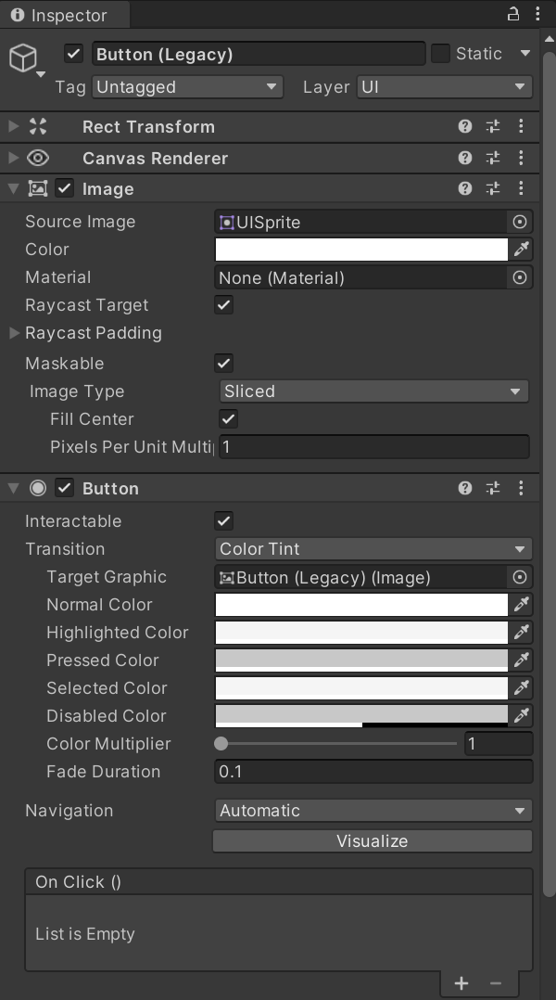

A UI button is an object that is meant to be clicked, they can respond to other events like hovering though. When a UI button object is created, it is automatically given a **Button** component which determines what the button looks like in its default state:

Like with Text objects, there is a text mesh pro variant and a legacy variant.

## Transition types
The **Transition** drop-down property is used to determine how the button reacts to being pressed, hovered over, or when disabled. The three transition options are **Color Tint**, **Sprite Swap**, and **Animation**.

## Text child
When a UI button is added, it is automatically given a **Text** child object in the **Hierarchy**. This text element functions as normal for a text element, but belongs to the button it is nested in; it can be deleted if wanted.

## On Click ()
The basic functionality of a button is to respond to being clicked, a default property is given for this event in the buttons **Inspector**. Clicking the `+` sign allows for registering what should happen when the button is clicked.

After clicking the `+` button, which can be used as many times as wanted, it first needs to be indicated whether the event runs at **Runtime Only** or **During Editor and Runtime**. Once this is done, an associated function to run when the button is clicked needs to be specified. This is done by dragging the object that has the desired script to access in to the object slot. Once that is done, the drop-down menu for functions will list all the scripts attached to the object; once a script is selected, the functions in the script can be chosen from.

## Adding other events to a button
To add other events to a button, add the **Event Trigger (Script)** component to the button. This allows you to choose from multiple different events to respond to. Once the event is chosen, registering what to do is the same as the on click event trigger that is present by default.