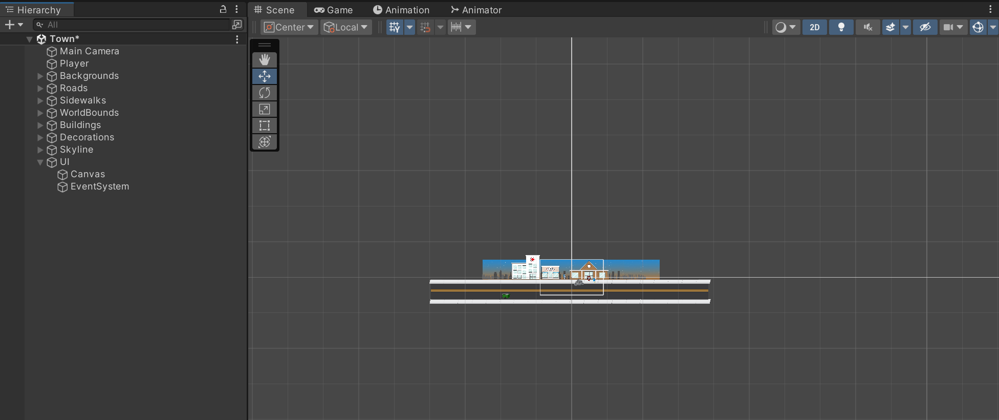

A **UI Canvas** is an object which holds all UI elements, they can be manually or automatically added (by adding a UI element) to a scene. All UI elements can be created using the **Hierarchy** **Create** menu.

When a UI canvas is added to a scene, an **EventSystem** object will also be added to the **Hierarchy**; this object is used to detect UI button presses and other UI interactions.

Once a new canvas has been added, it won't appear centred over the camera; this is normal.

Double clicking the canvas object in the Hierarchy will bring the full canvas into view, without the game objects blocking the view.

## EventSystem
When the canvas is created, an associated **EventSystem** object is added to the Hierarchy. This is an empty game object that will hold a few scripts related to the UI functionality. The event system provides built-in functionality for sending events to objects based on some type of input.

## Canvas Render Mode
An important aspect of canvases is the ability to change **Render Modes**, these determine how or if various UI objects will scale and position themselves when the camera size changes. Setting this property correctly makes the process of publishing to multiple platforms easier:

![[../images/canvas_render_mode_default.png]]

There are three different render modes available:

- Screen Space - Overlay
- Screen Space - Camera
- World Space

### Screen Space - Overlay
The **Screen Space - Overlay** rendering mode makes UI objects automatically scale based on the games resolution, the camera is not factored in. In this UI mode, all UI objects render in front of game objects in the world.

### Screen Space - Camera
The **Screen Space - Camera** rendering mode is similar to the overlay mode, the difference is that this mode renders all UI objects at a specified distance from the camera. For this mode, a specific camera has to be chosen to determine how the objects render. This mode is useful when a background image in the 2D game will automatically scale with the camera.

### World Space
The **World Space** rendering mode allows UI elements to be rendered as if they are on a plane positioned within the 3D space of a scene. The elements position and rotation can be set using the Canvas objects **Rect Transform** component. The UI elements will scale on their location relative to the camera. This mode is useful for UI elements that appear in a 3D game view, like health bars over a characters head, damage or health text, etc...

## Using multiple canvases
A scene can have multiple canvases, each with their own render mode. This is useful when needing different UI elements to render in different modes.

- A Heads Up Display (HUD) could be in a canvas with the overlay rendering mode
- A background image in another canvas with the camera rendering mode can also be used at the same time

Canvases can also have canvases as children, to create complex UI hierarchies.

If multiple canvases with the same rendering mode exist, they will normally be sorted according to their sorting order. If the sorting order has not been modified, the canvases lowest in the Hierarchy list will appear on top.