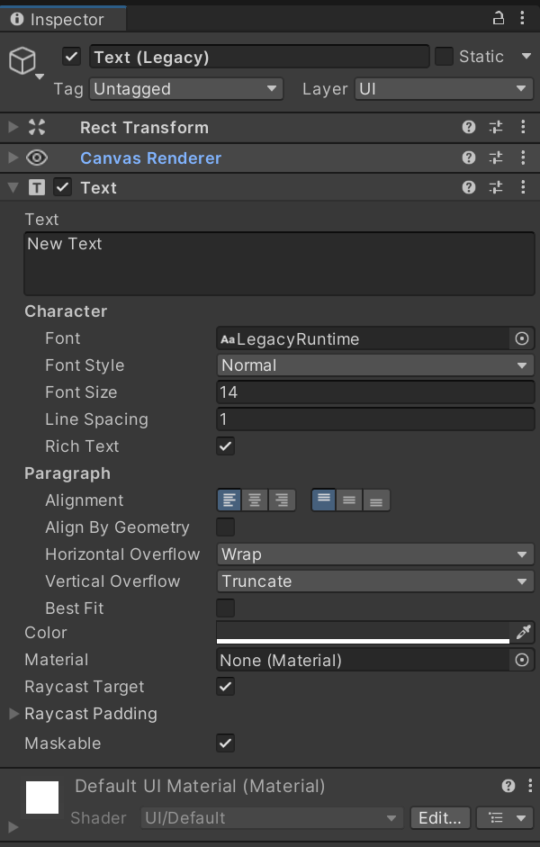
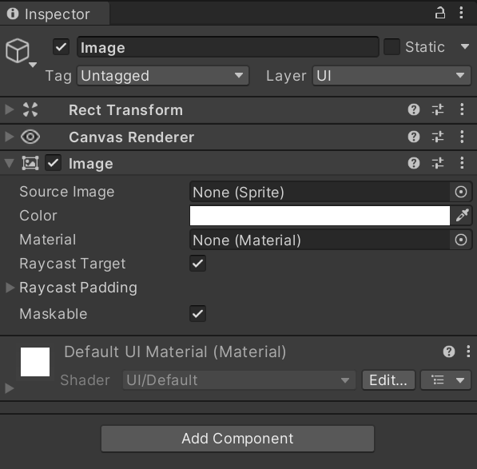

The simplest UI elements are the **Text** and **Image** objects. Interactive behaviour can be added to them, but they generally are not used in this way. Instead, they typically represents static UI objects which display information to the player.

## UI Text
The **UI Text** object allows for blocks of text to be placed on the canvas, this object will be given a **Text** component that can be used to control properties of the text; these properties can also be modified from a script by accessing the **Text** component. There are two different text objects, a modern text mesh pro and a legacy variant.

## UI Images
When a UI image object is created, it is given an **Image** component. It will initially appear as a white square until the source image is replaced, the source image must have a **Texture Type** in its import settings set to **Sprite (2D and UI)** for use as a UI image. The **Image** component contains the modifiable properties:

The **Color** property works like a colour overlay, any colour other than white will tint the linked image. This property can also be used to adjust the transparency of the image.

If an image is wanted to be used whose texture type is not a 2D sprite, the **Raw Image** UI object must be used instead.

