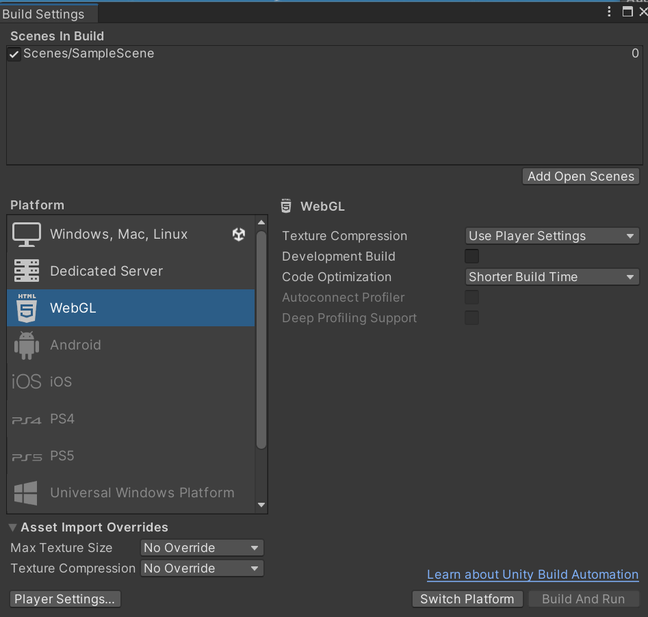

Currently, the camera does not follow the player. This results in the player disappearing off of the edge of the screen. Due to this, a *follow-camera* should be created. This is done as a script, for example:

```c#
public class FollowCamera : MonoBehaviour
{
    [SerializeField]
    private float xOffset = 0f; // distance between player and camera in horizontal direction
    [SerializeField]
    private float yOffset = 0f; // distance between player and camera in vertical direction
    [SerializeField]
    private Transform player; // ref to players transform object

    private void Awake()
    {
        player = GameObject.Find("Player").transform;

        if (player == null) Debug.LogError("Player object not found");
    }

    private void LateUpdate()
    {
        transform.position = new Vector3(player.position.x + xOffset, player.position.y + yOffset, -10);
    }
}
```

The `xOffset` and `yOffset` are used to make it so the player is not perfectly centred with the camera. Instead of using the `Awake` method to find the `Player` object, it could also have been dragged and dropped onto the script in the Unity editor.

Once the script is created, it should be added to the **Main Camera** game object as a component. This will result in the camera automatically following the player as they move.

## Comparing Update, FixedUpdate, and LateUpdate
There are three main methods which update the game, they all have separate usecases:

- `FixedUpdate()`: Called regularly throughout the games lifetime, generally used for physics and time-sensitive code.
- `Update()`: Only called after the end of each frame that is drawn to the screen, this call ends up being irregular as each frame can take a different amount of time to draw. It is best used for things that need to be continually checked or run.
- `LateUpdate()`: This is called after all other update methods have run, it is best used for things like camera movement or other items that need to be updated after everything else has been updated.

The `FixedUpdate()` and `Update()` methods do not have a defined order in which they are called, so it is not good practice to rely on any order for them.

## Resolution
The platform-resolution that a game renders at can be a stumbling block in Unity. By default, the Unity Editor runs in the **Free Aspect** mode. The **Aspect** mode can be changed using the drop-down in the **Game** window to represent the resolutions supported by each targeted platform, custom resolutions can also be added here:


To change the build target of a project, navigate to the **Build Settings** using `File > Build Settings`. The desired platform can be selected, then clicking on the **Switch Platform** button will action the change:



It is important to consider the aspect mode used in a game, setting everything up to use fixed bound settings for a camera or game objects may not work well for every resolution. This can result in out of range settings or objects that are undersized.

Additionally, the camera game object will have a `Size` property that can be adjusted to change the size of the area the camera views.

