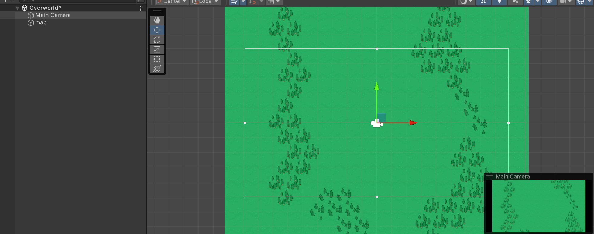
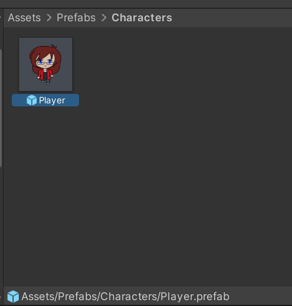
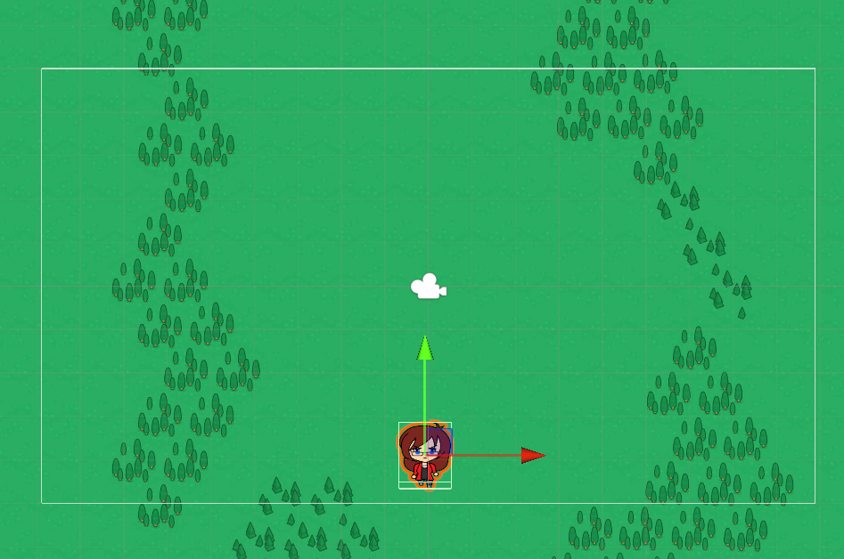
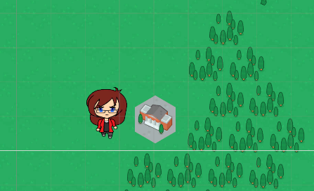
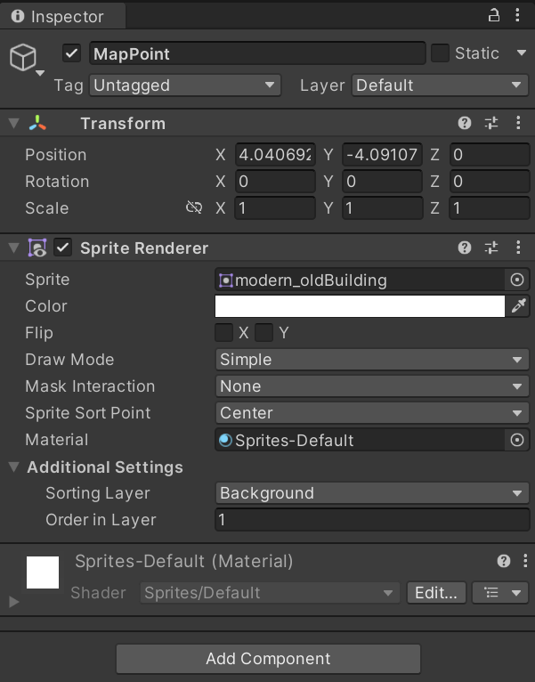
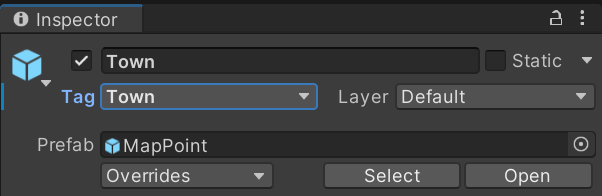
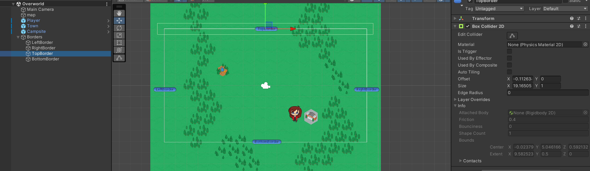

When implementing a map in a game in Unity, graphical support for the map is required alongside connecting the map to scenes in the game.

## Adding the world map
A scene will be used for the map in this case, first get a background image for the map and add it to the appropriate scene:

## Adding a player prefab
The player is used in almost every scene. Due to this, a way of reusing the player between scenes without recreating all the components and sprite is necessary.

**Prefab**s are reusable assets representing a GameObject, or collection of, with components and properties configured in a specific way. They serve as a template with unique editable instances that can be instantiated and reused throughout the project.

To create a prefab, select a game object in the hierarchy and drag it into the **Project** view:

Select the **Player** prefab and its components should become visible in the **Inspector**, reset the **Transform** coordinates to 0. This is good practice to make reusing the prefab easier.

> When a prefab is created and used in a scene, changes to the prefab are automatically reflected on any objects created from it. Changes to the objects themselves do not reflect on the prefab though by default, you can force this by selecting an instance of the prefab and selecting **Apply** in the inspector though - this will only affect existing properties and components, adding new scripts or components requires editing the prefab itself.

With this, the player prefab can be dragged onto the map to create a new player object for the map scene:

As the player prefab contains the components and scripts necessary for animations and movement, they will also work with this player instance.

## Adding places of interest
With the map in place, locations of interest like places that can be visited can be added to the map:

Rename the object appropriately and add a `Box Collider 2D` component to it, set the colliders `Is Trigger` property to `true`/checked.

- With a colliders `OnTrigger` property set to true/checked, it causes the `OnTrigger` methods to trigger (`OnTriggerEnter2D` and `OnTriggerExit2D`) instead of the `OnCollision` methods.

Use this first map point to create a prefab. Once the prefab is created, the instance can be given an appropriate name such as `Town`. Also, add a tag to the object to help identify the object from code:

Then add any other points of interest to the map by dragging and dropping the `MapPoint` prefab onto the scene. Once that is done, it can then be decided whether to have large boundaries/borders on the map or ones constrained to just the camera area. Add box colliders for these borders to the map:

