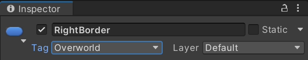
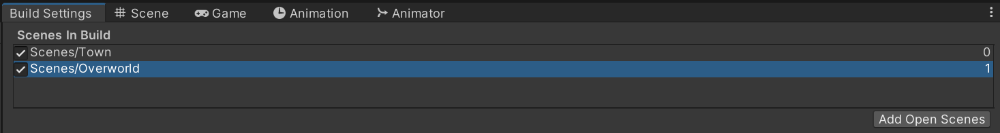

To allow movement to occur between scenes, some scripting needs to be done to enable the behaviour. This could be done with a simple `SceneManager` script that is triggered when a specific collider is hit, but it wouldn't be very extensible for large worlds with a lot of interactions. A separate navigation system with everything in one place is more appropriate and easier to manage.

## Creation a NavigationManager script
In the game being created, there is a left and right border to the town scene. Create new tags called `Construction` and `Overworld`, applying `Overworld` to the right border and `Construction` to the left:



Then create a new C# script called `NavigationManager` in `Assets/Scripts/Navigation`:

```c#
public static class NavigationManager
{
    public static Dictionary<string, string> routeInformation = new Dictionary<string, string>()
    {
        { "Overworld", "The outer world" },
        { "Construction", "The towns construction area" }
    };

    public static string GetRouteInformation(string routeName)
    {
        return routeInformation.GetValueOrDefault(routeName, null);
    }

    public static bool CanNavigate(string destination)
    {
        return true;
    }

    public static void NavigateTo(string destination)
    {

    }
}
```

- `routeInformation`: A static class member listing the possible game destinations, keeping everywhere that can be travelled to in one location.
- `GetRouteInformation`: Simple function to retrieve the description of a route.
- `CanNavigate`: Used for testing if a player can travel to a specific location.
- `NavigateTo`: Used to initiate travel to a different area by loading a new scene.

The class is `static` as it is mostly a background class with the same behaviour used throughout the program, it can be used anywhere at any time.

Now, open the `NavigationManager` script and update the collision method to reference the `NavigationManager` rather than directly interrogating the tags of the collided object:

```c#
public class NavigationPrompt : MonoBehaviour
{
    private void OnCollisionEnter2D(Collision2D collision)
    {
        if (NavigationManager.CanNavigate(this.tag))
        {
            Debug.Log("Attempting to exit via " + this.tag);
            NavigationManager.NavigateTo(this.tag);
        }
    }
}
```

Then remove the `NavigationPrompt` script component from the `Player` object and add it to the left and right border objects, remove the `NavigationPrompt` by removing it from the `Player` prefab.

## Blocking off paths
In games, some routes will be traversable but others won't. One such way is to create a data type for representing this.

In the `NavigationManager` script, add the following `struct` as a class member:

```c#
public struct Route
{
    public string routeDescription;
    public bool canTravel;
}
```

Then update the `routeInformation` static member to make use of the struct:

```c#
public static Dictionary<string, Route> routeInformation = new Dictionary<string, Route>()
{
    { "Overworld", new Route { routeDescription = "The outer world", canTravel = true } },
    { "Construction", new Route { routeDescription = "The towns construction area", canTravel = false } }
};
```

Then update the `GetRouteInformation` method to account for the change in structure:

```c#
public static string GetRouteInformation(string routeName)
{
    if (routeInformation.ContainsKey(routeName)) return routeInformation[routeName].routeDescription;
    return null;
}
```

Then update the `CanNavigate` method to account for the `canTravel` flag in the `Route` struct:

```c#
public static bool CanNavigate(string destination)
{
    if (routeInformation.ContainsKey(destination)) return routeInformation[destination].canTravel;
    return false;
}
```

## Updating build settings to include new scenes
As code will be used to transition between scenes, the projects build settings need to be updated to account for this. Open the **Build Settings** options using **File > Build Settings**, then drag the desired scenes from the **Project** window to the list:



It is important to consider the order of scenes in the build, the scene at index 0 will always be the first scene loaded. Some developers like putting the levels in order to use the index to progress through scenes.

## Changing scenes
With the multiple scenes added to the build settings, open the `NavigationManager` script and update the `NavigateTo` method:

```c#
public static void NavigateTo(string destination)
{
    SceneManager.LoadScene(destination);
}
```

- The `SceneManager.LoadScene(string scene)` method loads a scene by name or its index, make sure to include the `using UnityEngine.SceneManagement` namespace at the top of the file.

With this, the navigation from the town to the overworld should function.

## Adding on trigger travel
Some colliders are set as triggers, without associated colliders for detecting collisions. To ensure they can also trigger navigation, update the `NavigationPrompt` to work with triggers:

```c#
private void OnTriggerEnter2D(Collider2D collision)
{
    if (NavigationManager.CanNavigate(tag))
    {
        Debug.Log("Attempting to exit via " + tag);
        NavigationManager.NavigateTo(tag);
    }
}
```

As the `MapPoint` prefab instances only have a trigger collider, add the `NavigationPrompt` script to the `MapPoint` prefab.